<!-- VISUAL-LIBRARY-GALLERY:START -->
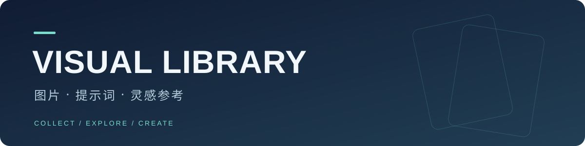

**541 个案例 · 13 个分类 · 22 个模板**

[打开完整画廊](docs/gallery.md) · [提示词模板](docs/templates.md)

### 分类浏览

<table>
<tr>
<td width="33%" align="center" valign="top"> <a href="docs/categories/cat-ui.md"><strong>UI 与界面</strong></a> 73 个案例 App、网页、仪表盘、社媒截图与产品界面。</td>
<td width="33%" align="center" valign="top"><a href="docs/categories/cat-infographic.md">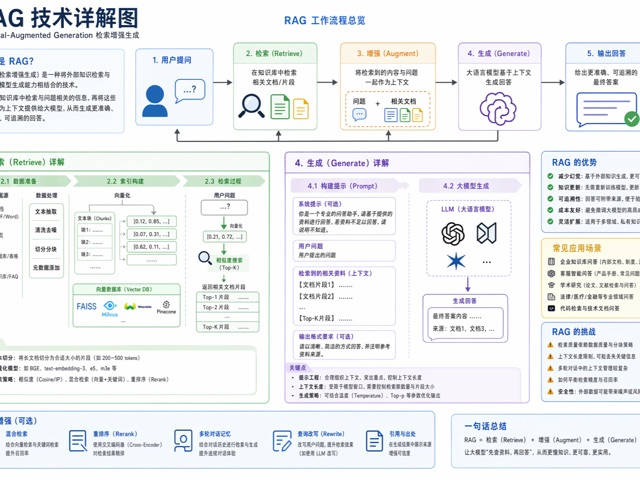</a> <a href="docs/categories/cat-infographic.md"><strong>图表与信息可视化</strong></a> 53 个案例 信息图、知识图谱、技术解释与结构化图解。</td>
<td width="33%" align="center" valign="top"> <a href="docs/categories/cat-poster.md"><strong>海报与排版</strong></a> 90 个案例 活动海报、封面、字体视觉和强排版画面。</td>
</tr>
<tr>
<td width="33%" align="center" valign="top"> <a href="docs/categories/cat-product.md"><strong>商品与电商</strong></a> 42 个案例 商品图、详情页、包装卖点和商业广告。</td>
<td width="33%" align="center" valign="top"><a href="docs/categories/cat-brand.md">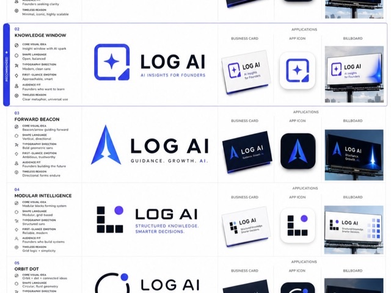</a> <a href="docs/categories/cat-brand.md"><strong>品牌与标志</strong></a> 27 个案例 Logo、VI、品牌触点和 Campaign 视觉系统。</td>
<td width="33%" align="center" valign="top"><a href="docs/categories/cat-architecture.md">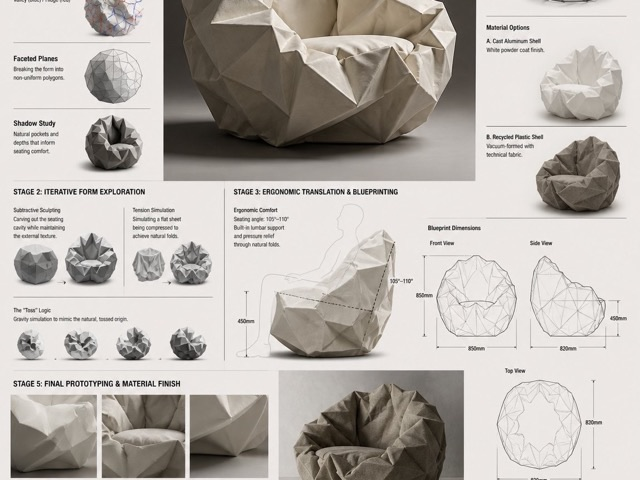</a> <a href="docs/categories/cat-architecture.md"><strong>建筑与空间</strong></a> 12 个案例 建筑表现、室内空间、城市地图和空间概念。</td>
</tr>
<tr>
<td width="33%" align="center" valign="top"><a href="docs/categories/cat-photo.md">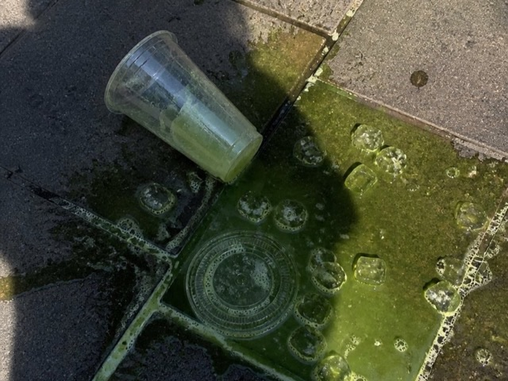</a> <a href="docs/categories/cat-photo.md"><strong>摄影与写实</strong></a> 78 个案例 人像、手机纪实、胶片质感和商业摄影。</td>
<td width="33%" align="center" valign="top"><a href="docs/categories/cat-illustration.md">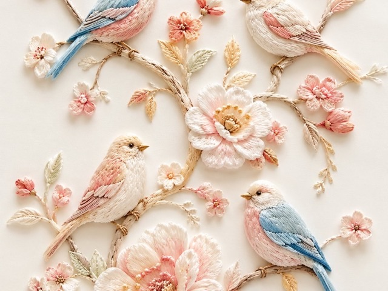</a> <a href="docs/categories/cat-illustration.md"><strong>插画与艺术</strong></a> 59 个案例 插画、艺术风格、材质实验和装饰画面。</td>
<td width="33%" align="center" valign="top"> <a href="docs/categories/cat-character.md"><strong>人物与角色</strong></a> 31 个案例 角色设定、动作参考、卡牌和 3D 玩具。</td>
</tr>
<tr>
<td width="33%" align="center" valign="top"><a href="docs/categories/cat-scene.md">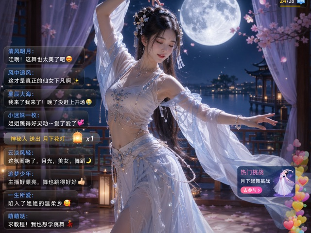</a> <a href="docs/categories/cat-scene.md"><strong>场景与叙事</strong></a> 21 个案例 分镜、故事场景、直播画面和世界观叙事。</td>
<td width="33%" align="center" valign="top"><a href="docs/categories/cat-history.md">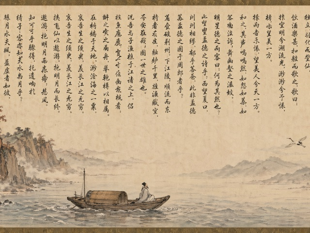</a> <a href="docs/categories/cat-history.md"><strong>历史与古风题材</strong></a> 16 个案例 古风长卷、历史人物、传统题材和诗词画面。</td>
<td width="33%" align="center" valign="top"><a href="docs/categories/cat-document.md">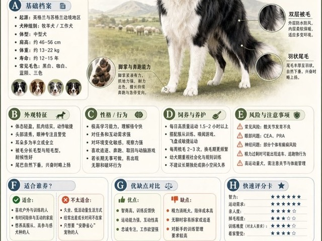</a> <a href="docs/categories/cat-document.md"><strong>文档与出版物</strong></a> 11 个案例 白皮书、手册、百科图鉴和出版页设计。</td>
</tr>
<tr>
<td width="33%" align="center" valign="top"><a href="docs/categories/cat-other.md">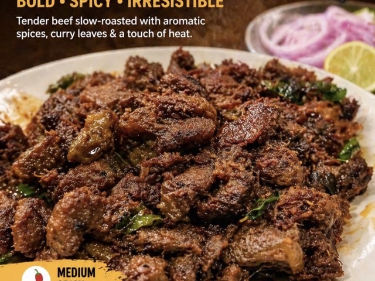</a> <a href="docs/categories/cat-other.md"><strong>其他应用场景</strong></a> 28 个案例 创意实验、特殊任务、混合玩法和实用场景。</td>
<td width="33%" align="center" valign="top"></td>
<td width="33%" align="center" valign="top"></td>
</tr>
</table>

### 最近收录

<table>
<tr>
<td width="33%" align="center" valign="top"><a href="cases/case-awesome-gpt-image-2-544-17752a2360f7/v1.md">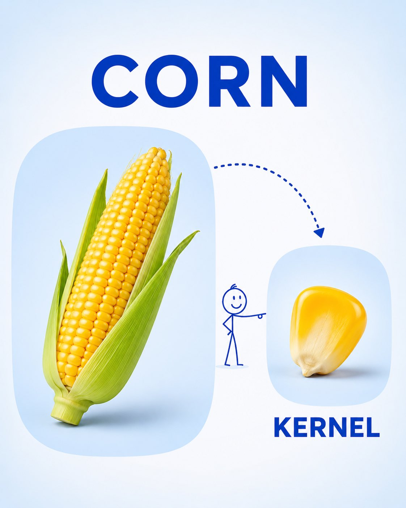</a> <a href="cases/case-awesome-gpt-image-2-544-17752a2360f7/v1.md"><strong>幼儿词汇拆解学习卡 · v1</strong></a> awesome-gpt-image-2 #544</td>
<td width="33%" align="center" valign="top"><a href="cases/case-awesome-gpt-image-2-543-06879a313369/v1.md">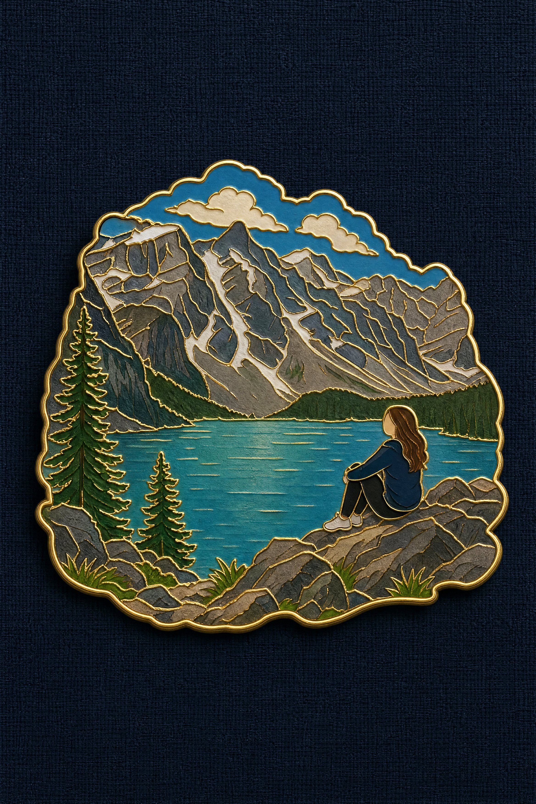</a> <a href="cases/case-awesome-gpt-image-2-543-06879a313369/v1.md"><strong>旅行纪念珐琅徽章 · v1</strong></a> awesome-gpt-image-2 #543</td>
<td width="33%" align="center" valign="top"> <a href="cases/case-awesome-gpt-image-2-542-f0f1211f8e48/v1.md"><strong>黑白排版侧脸肖像海报 · v1</strong></a> awesome-gpt-image-2 #542</td>
</tr>
<tr>
<td width="33%" align="center" valign="top"><a href="cases/case-awesome-gpt-image-2-541-e488bf2c9548/v1.md">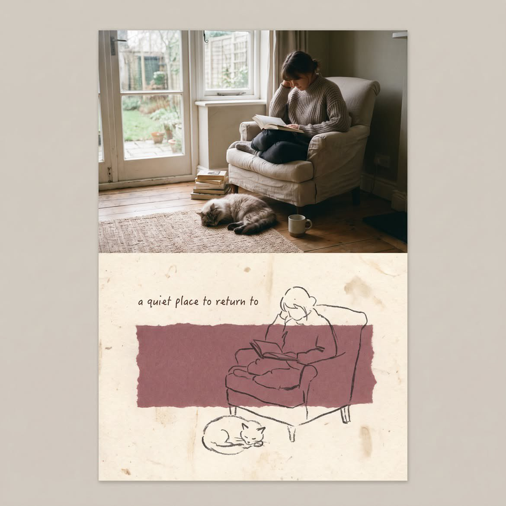</a> <a href="cases/case-awesome-gpt-image-2-541-e488bf2c9548/v1.md"><strong>50/50 混合媒介回忆卡 · v1</strong></a> awesome-gpt-image-2 #541</td>
<td width="33%" align="center" valign="top"> <a href="cases/case-awesome-gpt-image-2-540-0060e6408103/v1.md"><strong>梦幻未来城市编辑艺术海报 · v1</strong></a> awesome-gpt-image-2 #540</td>
<td width="33%" align="center" valign="top"> <a href="cases/case-awesome-gpt-image-2-539-c5c77f1cba30/v1.md"><strong>粗粝手绘搭档肖像海报 · v1</strong></a> awesome-gpt-image-2 #539</td>
</tr>
</table>

<!-- VISUAL-LIBRARY-GALLERY:END -->

## 使用资料库

你可以直接看图挑选，也可以把仓库链接交给 Codex，让它读取项目说明后查找资料。每个案例保留图片、完整提示词、版本和原始来源。

<strong>让 Codex 帮我找参考</strong>

阅读这个仓库的 README 和 AGENTS.md，帮我找几张复古暖色人像参考。展示候选图片、案例编号和版本，需要时提供完整提示词。

<strong>检索、收藏和更新说明</strong>

- [查看完整使用说明](docs/usage.md)
- [Codex 项目规则](AGENTS.md)
- [查看同步任务](https://github.com/yangchengwu2024/visual-library/actions/workflows/sync.yml)

图片和提示词保存在本仓库。定时同步追加新资料，保留旧版本和个人记录；普通上游删除不会自动删除本库内容。

## 来源

资料主要来自 [awesome-gpt-image-2](https://github.com/freestylefly/awesome-gpt-image-2)，保留作者与来源信息。使用范围见 [第三方内容说明](THIRD_PARTY.md)。

## Codex MCP入口

已提供自有只读MCP：查案例、读指定版本、查看图片、查分类与模板。[连接与使用说明](docs/mcp.md)。资料仍保存在本仓库。
