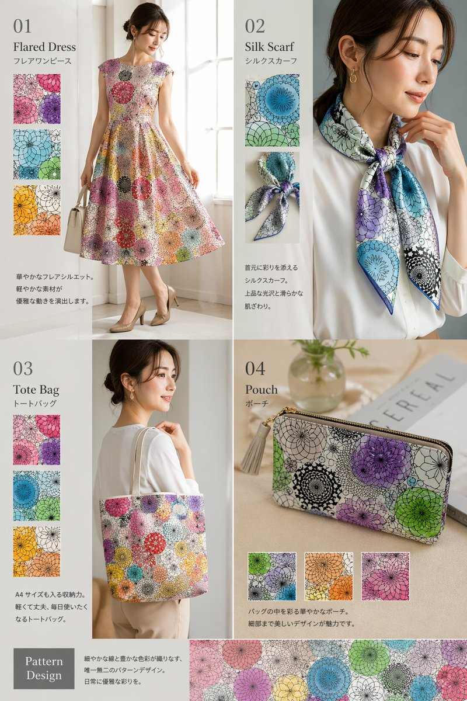

<!-- GENERATED from version JSON, sidecar metadata and personal corrections. Do not edit this reading copy. -->
# 封面排版设计图

[返回画廊总览](../../docs/gallery.md) · [版本与来源记录](case.json)

案例编号：`case-awesome-gpt-image-2-138-438051b2711b` · 版本：`v1`

版本说明：首次收录

资料类型：案例 · 复核状态：已复核

复核说明：已实际看图并阅读全文。花纹裙、围巾、包袋与花样色片目录；pattern由文本描述，不要求另附纹样图。 本次核对资料关系、图片角色和输入条件，不代表身份、事实或逐像素生成正确性验收。

## 案例图片

### 图片 1 · 输出效果图

来源角色：`source_example`

角色依据：花纹裙、围巾、包袋与花样色片目录；pattern由文本描述，不要求另附纹样图。



## 完整提示词

```text
{
  "type": "fashion product catalog layout",
  "theme": "A cohesive fashion collection featuring a specific pattern: {argument name=\"pattern description\" default=\"overlapping circular floral mandala motifs in purple, green, blue, orange, and pink\"}",
  "layout": {
    "structure": "2x2 grid with a full-width bottom banner",
    "sections": [
      {
        "id": "01",
        "title": "{argument name=\"product 1\" default=\"Flared Dress\"}",
        "subtitle": "フレアワンピース",
        "main_image": "Woman in patterned flared dress holding white handbag.",
        "swatch_count": 3,
        "swatch_descriptions": ["purple variant", "green/blue variant", "orange/yellow variant"],
        "description_text": "華やかなフレアシルエット。軽やかな素材が優雅な動きを演出します。"
      },
      {
        "id": "02",
        "title": "{argument name=\"product 2\" default=\"Silk Scarf\"}",
        "subtitle": "シルクスカーフ",
        "main_image": "Woman in white blouse with patterned silk scarf.",
        "swatch_count": 2,
        "swatch_descriptions": ["flat pattern detail", "tied knot detail"],
        "description_text": "首元に彩りを添えるシルクスカーフ。上品な光沢と滑らかな肌ざわり。"
      },
      {
        "id": "03",
        "title": "{argument name=\"product 3\" default=\"Tote Bag\"}",
        "subtitle": "トートバッグ",
        "main_image": "Woman carrying patterned tote bag.",
        "swatch_count": 3,
        "swatch_descriptions": ["purple variant", "blue variant", "orange/yellow variant"],
        "description_text": "A4サイズも入る収納力。軽くて丈夫、毎日使いたくなるトートバッグ。"
      },
      {
        "id": "04",
        "title": "{argument name=\"product 4\" default=\"Pouch\"}",
        "subtitle": "ポーチ",
        "main_image": "Patterned zip pouch on table with magazine and vase.",
        "swatch_count": 3,
        "swatch_descriptions": ["green/purple variant", "orange variant", "pink variant"],
        "description_text": "バッグの中を彩る華やかなポーチ。細部まで美しいデザインが魅力です。"
      }
    ],
    "bottom_banner": {
      "title": "Pattern Design",
      "description_text": "細やかな線と豊かな色彩が織りなす、唯一無二のパターンデザイン。日常に優雅な彩りを。",
      "image": "Horizontal strip showing the seamless pattern."
    }
  }
}
```

[查看原始来源](https://x.com/aiehon_aya)
