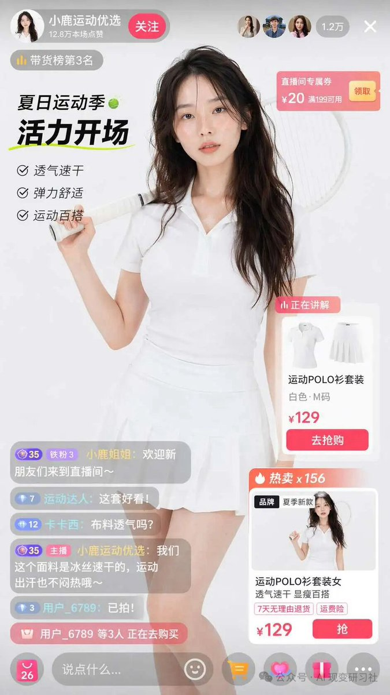

<!-- GENERATED from version JSON, sidecar metadata and personal corrections. Do not edit this reading copy. -->
# 界面交互设计图

[返回画廊总览](../../docs/gallery.md) · [版本与来源记录](case.json)

案例编号：`case-awesome-gpt-image-2-158-cc333a97b548` · 版本：`v1`

版本说明：首次收录

资料类型：案例 · 复核状态：已复核

复核说明：白色运动套装女性持球拍与直播商品卡。已阅读全文并查看样图，图片为结果示例；未发现必须补充某一指定输入图片。

## 案例图片

### 图片 1 · 输出效果图

来源角色：`source_example`

角色依据：白色运动套装女性持球拍与直播商品卡



## 完整提示词

```text
{
  "type": "e-commerce live stream interface mockup",
  "subject": {
    "description": "young Asian woman, long wavy dark hair, wearing a white short-sleeve polo shirt and white pleated tennis skirt, holding a white tennis racket over her right shoulder, looking directly at the camera with a soft expression",
    "background": "soft light grey studio background"
  },
  "layout": {
    "header": {
      "left": {
        "avatar": "female portrait",
        "name": "{argument name=\"host name\" default=\"小鹿运动优选\"}",
        "stats": "12.8万本场点赞",
        "button": "关注",
        "badge": "带货榜第3名"
      },
      "right": {
        "viewer_avatars_count": 3,
        "viewer_count": "1.2万",
        "close_icon": "X"
      }
    },
    "floating_elements": [
      {
        "position": "top right",
        "type": "coupon card",
        "title": "直播间专属券",
        "details": "¥20 满199可用",
        "button": "领取"
      },
      {
        "position": "mid left",
        "type": "campaign text",
        "subtitle": "夏日运动季",
        "headline": "{argument name=\"main headline\" default=\"活力开场\"}",
        "bullet_points_count": 3,
        "bullet_points": ["透气速干", "弹力舒适", "运动百搭"]
      },
      {
        "position": "mid right",
        "type": "product card active",
        "badge": "正在讲解",
        "image": "white polo and skirt flat lay",
        "title": "{argument name=\"product name\" default=\"运动POLO衫套装\"}",
        "details": "白色·M码",
        "price": "{argument name=\"price\" default=\"¥129\"}",
        "button": "去抢购"
      },
      {
        "position": "bottom right",
        "type": "product card secondary",
        "badge": "热卖 x 156",
        "image": "model wearing the outfit",
        "title": "运动POLO衫套装女 透气速干 显瘦百搭",
        "tags": ["7天无理由退货", "运费险"],
        "price": "¥129",
        "button": "抢"
      }
    ],
    "chat_overlay": {
      "position": "bottom left",
      "message_count": 5,
      "messages": [
        "小鹿姐姐: 欢迎新朋友们来到直播间~",
        "运动达人: {argument name=\"chat message\" default=\"这套好看!\"}",
        "卡卡西: 布料透气吗?",
        "小鹿运动优选: 我们这个面料是冰丝速干的，运动出汗也不闷热哦~",
        "用户_6789: 已拍!"
      ],
      "purchase_alert": "用户_6789 等3人 正在去购买"
    },
    "footer": {
      "input_bar": "说点什么...",
      "icons_count": 5,
      "icons": ["smile", "shopping cart", "heart", "share", "more"]
    }
  }
}
```

[查看原始来源](https://x.com/coconut_256)
