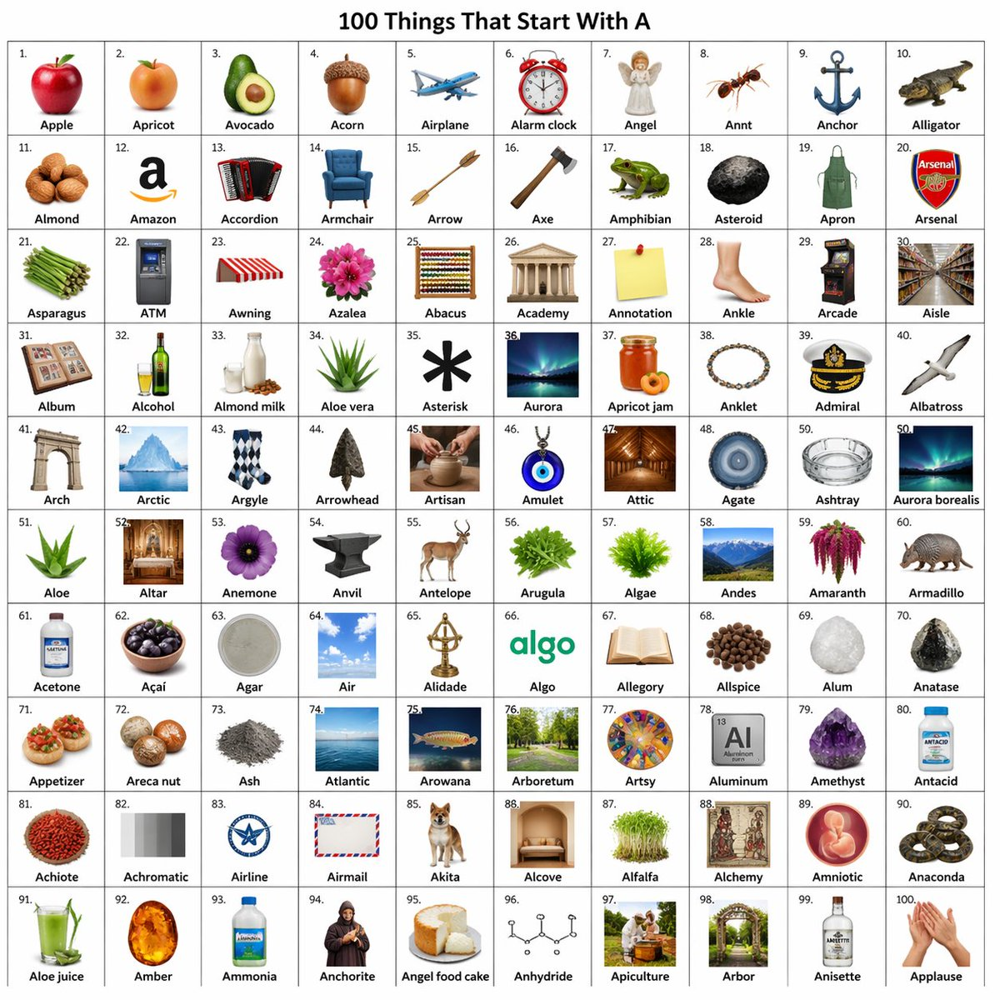

<!-- GENERATED from version JSON, sidecar metadata and personal corrections. Do not edit this reading copy. -->
# 信息图可视化设计

[返回画廊总览](../../docs/gallery.md) · [版本与来源记录](case.json)

案例编号：`case-awesome-gpt-image-2-171-364397d8222a` · 版本：`v1`

版本说明：首次收录

资料类型：案例 · 复核状态：已复核

复核说明：以 A 开头物件十乘十网格，是完整字母教学输出图。已实际看样图并阅读完整 prompt；复核资料关系与输入条件，不代表生成复现或逐项事实准确性验收。

## 案例图片

### 图片 1 · 输出效果图

来源角色：`source_example`

角色依据：以 A 开头物件十乘十网格，是完整字母教学输出图



## 完整提示词

```text
[中文]
创建一个包含 10x10 网格的图像，每个对象名称都以字母 a 开头。

[English]
create an image with 10x10 grid of objects that have the names starting with letter a.
```

[查看原始来源](https://x.com/umesh_ai/status/2046510988367945983)
