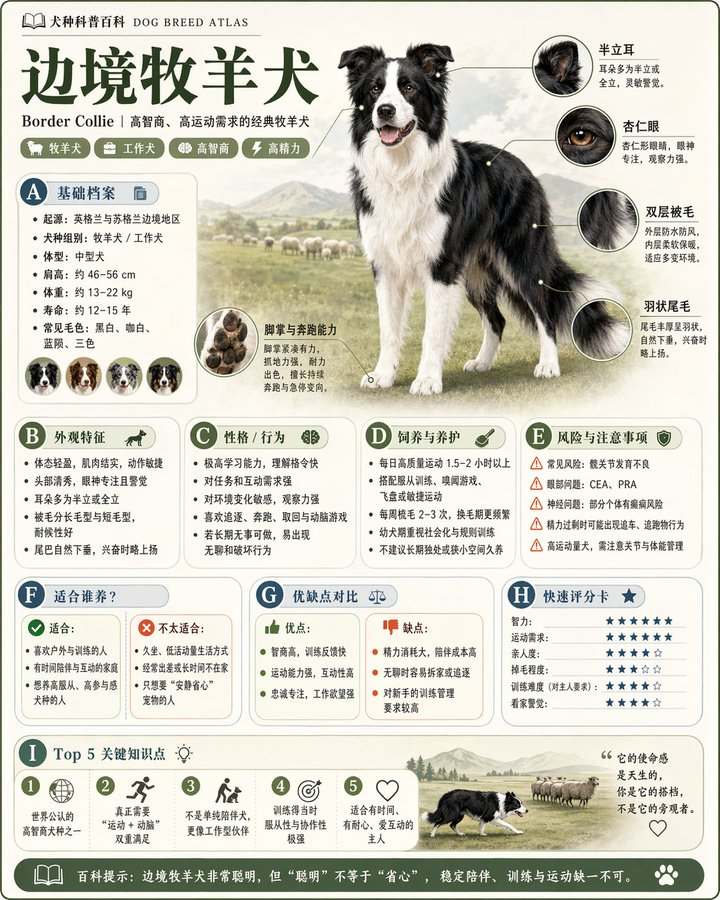

<!-- GENERATED from version JSON, sidecar metadata and personal corrections. Do not edit this reading copy. -->
# 精致模块化科普百科图鉴

[返回画廊总览](../../docs/gallery.md) · [版本与来源记录](case.json)

案例编号：`case-awesome-gpt-image-2-222-89f8104f5b3b` · 版本：`v1`

版本说明：首次收录

资料类型：案例 · 复核状态：已复核

复核说明：已实际看图并阅读全文。边境牧羊犬与圆角百科栏目；主题占位模板，样图演示犬种，未要求参考照。 本次核对资料关系、图片角色和输入条件，不代表身份、事实或逐像素生成正确性验收。

## 案例图片

### 图片 1 · 输出效果图

来源角色：`source_example`

角色依据：边境牧羊犬与圆角百科栏目；主题占位模板，样图演示犬种，未要求参考照。



## 完整提示词

```text
[中文]
请根据【主题】生成一张高质量竖版「科普百科图」。

这张图不是普通海报，也不是单纯插画，而是一张兼具“图鉴感、百科感、信息结构感、收藏感”的模块化科普信息图。整体风格参考高级博物图鉴、现代百科书页、生活方式知识卡和社交媒体高传播信息图的结合。

请让画面包含：
- 一个清晰漂亮的主题主视觉
- 若干局部特征放大细节
- 多个圆角模块化信息分区
- 清楚的标题层级与重点标签
- 简洁但丰富的百科内容
- 可视化评分、要点总结或Top 5模块

内容栏目请根据主题自动适配，优先从这些方向中选择并合理组合：
基础档案、分类信息、外观特征、习性/生态、形成机制/结构组成、生长或使用条件、养护或维护建议、风险与注意事项、适合人群或适用场景、优缺点对比、快速评分卡。

视觉要求：
浅色干净背景，柔和配色，轻阴影，精致小图标，圆角信息框，整洁排版，信息密度高但不拥挤，阅读体验好。整体必须像真正可以发布、阅读、收藏、系列化生产的科普百科卡，而不是广告图。

请不要做成普通商业宣传海报。要突出“知识整理 + 模块信息 + 图鉴式展示”的特征。

[English]
Please generate a high-quality vertical "Popular Science Encyclopedia Infographic" based on the [Topic].

This image is not an ordinary poster, nor a simple illustration, but a modular popular science infographic with a sense of "illustrated guide, encyclopedia, information structure, and collectibility". The overall style references a combination of high-end natural history illustrated guides, modern encyclopedia pages, lifestyle knowledge cards, and highly shared social media infographics.

Please make the image contain:
- A clear and beautiful theme main visual
- Several enlarged details of local features
- Multiple rounded modular information sections
- Clear title hierarchy and key tags
- Concise but rich encyclopedia content
- Visualized scoring, key point summaries, or Top 5 modules

Content columns should automatically adapt to the topic, prioritizing selection and reasonable combination from these directions:
Basic profile, classification information, appearance features, habits/ecology, formation mechanism/structural composition, growth or usage conditions, care or maintenance suggestions, risks and precautions, suitable groups or applicable scenarios, pros and cons comparison, quick scorecard.

Visual requirements:
Light-colored clean background, soft color palette, light shadows, exquisite small icons, rounded information boxes, neat typography, high information density but not crowded, good reading experience. The overall look must be like a real popular science encyclopedia card that can be published, read, collected, and serialized, rather than an advertisement.

Please do not make it into an ordinary commercial promotional poster. It must highlight the characteristics of "knowledge organization + modular information + illustrated guide style display".
```

[查看原始来源](https://x.com/MrLarus/status/2046231542817497392)
