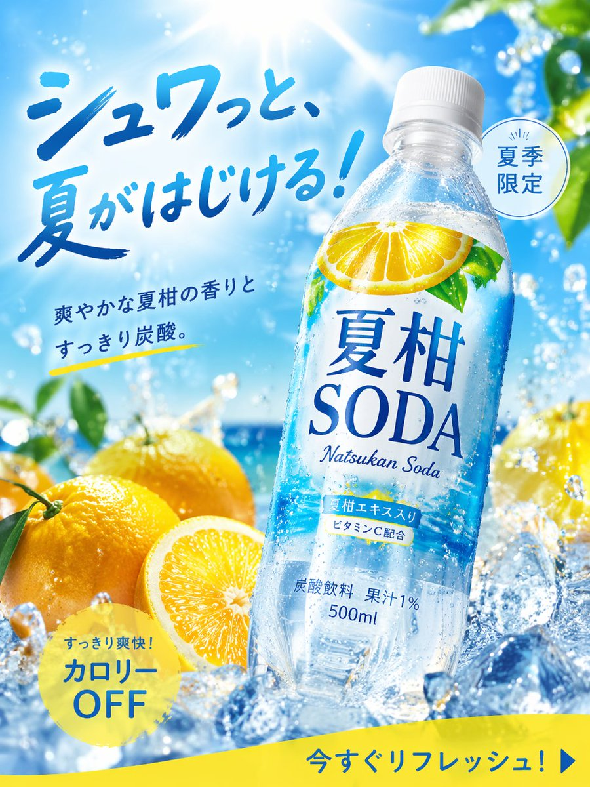

<!-- GENERATED from version JSON. Do not edit this reading copy. -->
# 夏日柑橘苏打高转化广告图

[返回画廊总览](../../docs/gallery.md) · [版本与来源记录](case.json)

案例编号：`case-awesome-gpt-image-2-237-025d5b62b5e9` · 版本：`v1`

版本说明：首次收录

## 案例图片



## 完整提示词

```text
[中文]
图像生成: 商品广告照片, 适合夏天的季节商品, 碳酸饮料, 名称="夏柑SODA", 形状=PET瓶500ml, 研究2025年作为饮料广告的高CTA设计后设计并生成图像规格, 宽高比3:4

[English]
Image generation: Product advertising photo, Seasonal product suitable for summer, Carbonated beverage, Name="Summer Citrus SODA", Shape=500ml PET bottle, Design and generate image specifications after researching high CTA design as a beverage advertisement in 2025, Aspect ratio 3:4
```

[查看原始来源](https://x.com/old_pgmrs_will/status/2045852114673635507)
