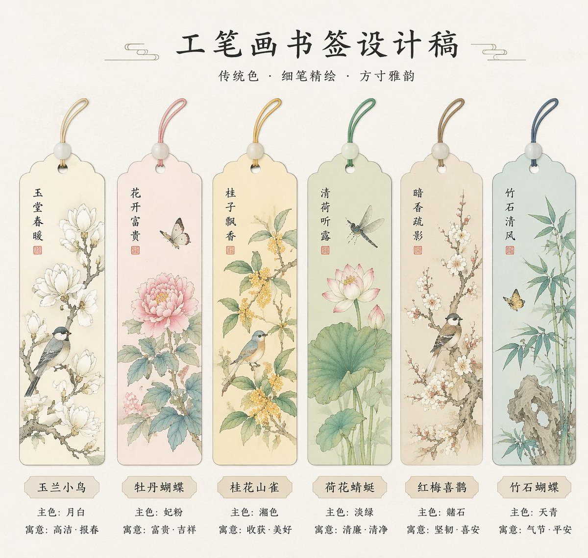

<!-- GENERATED from version JSON. Do not edit this reading copy. -->
# 绝美国风工笔画书签设计

[返回画廊总览](../../docs/gallery.md) · [版本与来源记录](case.json)

案例编号：`case-awesome-gpt-image-2-242-0a249070a2c2` · 版本：`v1`

版本说明：首次收录

## 案例图片



## 完整提示词

```text
[中文]
生成一系列工笔画书签的设计稿

[English]
Generate a series of design drafts for Gongbi painting bookmarks.
```

[查看原始来源](https://x.com/akokoi1/status/2045693939584516441)
