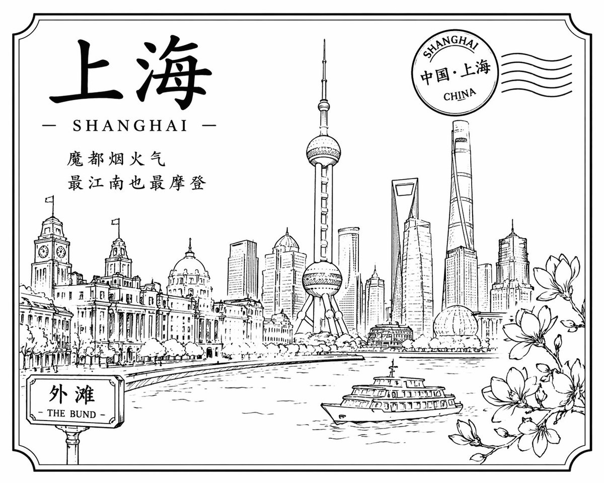

<!-- GENERATED from version JSON. Do not edit this reading copy. -->
# 黑白线稿勾勒的上海风情

[返回画廊总览](../../docs/gallery.md) · [版本与来源记录](case.json)

案例编号：`case-awesome-gpt-image-2-246-259086cd2ade` · 版本：`v1`

版本说明：首次收录

## 案例图片



## 完整提示词

```text
[中文]
设计一张黑色线稿风格的上海明信片

[English]
Design a Shanghai postcard in black line art style.
```

[查看原始来源](https://x.com/akokoi1/status/2045693939584516441)
