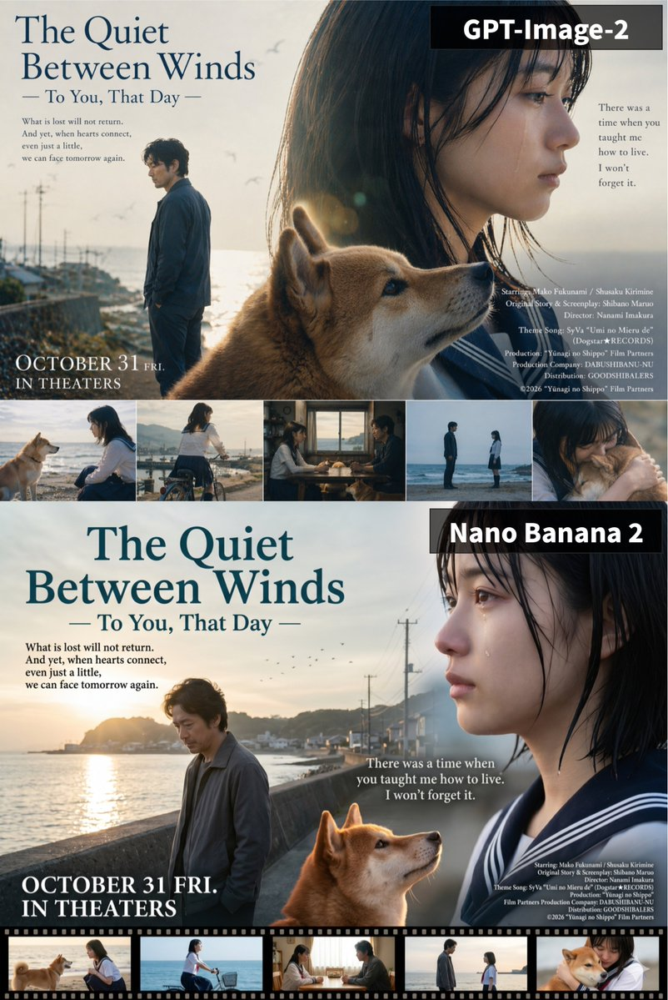

<!-- GENERATED from version JSON, sidecar metadata and personal corrections. Do not edit this reading copy. -->
# 一张采用分层蒙太奇构图的电影海报

[返回画廊总览](../../docs/gallery.md) · [版本与来源记录](case.json)

案例编号：`case-awesome-gpt-image-2-275-9747d381ef17` · 版本：`v1`

版本说明：首次收录

资料类型：案例 · 复核状态：已复核

复核说明：已实际看图并阅读全文。上下两张海滨男子、女子与柴犬电影海报，分别有模型比较标签；分层prompt描述的是输出构图，胶片条与另一海报均不是输入图。 本次核对资料关系、图片角色和输入条件，不代表身份、事实或逐像素生成正确性验收。

## 案例图片

### 图片 1 · 输出效果图

来源角色：`source_example`

角色依据：上下两张海滨男子、女子与柴犬电影海报，分别有模型比较标签；分层prompt描述的是输出构图，胶片条与另一海报均不是输入图。



## 完整提示词

```text
[中文]
“一张采用分层蒙太奇构图的电影海报。背景为日落时分的海滨小镇，平静的海面倒映着耀眼的日光眩光，薄雾笼罩的天空中有远处飞鸟，沿海公路旁立着电线杆剪影。左侧中景处，一位身着深灰色外套、留着深色卷发的中年男子站在混凝土海堤边，神情忧郁地低头凝视，被傍晚的阳光逆光勾勒轮廓。右侧前景主体为一张大幅特写年轻女子侧脸肖像，她望向右侧，身穿带白色条纹的深色水手校服，湿润的黑发贴在脸颊，柔和漫射光线下，一滴泪珠从她脸颊滑落。画面下方中央前景处，一只柴犬抬头朝右侧望去，红棕色毛发被温暖的轮廓光点亮。画面最底端为一条横向电影胶片，内含五幅独立矩形场景缩略图：女孩与柴犬在海滩、女孩骑车望向海面、女孩与男子坐在室内桌前、男子与女孩在海滩面对面站立、女孩拥抱柴犬的特写。画面叠加指定文字：左上角为深青绿色大号衬线字体标题《风间静语》，下方副标题为「—— 致那日的你 ——」；标题下方为小号深色衬线正文：“逝去之物，不复归来。然而，只要心灵稍稍相连，我们便能再度直面明日。” 画面右侧中部为深色衬线字体文字：“曾有一段时光，是你教会我如何生活。我永不会忘。” 左下角为大号白色文字：“10 月 31 日 周五 影院上映”。右下角为小号白色无衬线字体演职人员表：“主演：福波真子 / 桐嶋秀作 原作与剧本：柴野麻吕 导演：今仓七海 主题曲：SyVa《看得见海的地方》（Dogstar★唱片） 制作：《夕凪之尾》影视伙伴 制作公司：DABUSHIBANU-NU 发行：GOODSHIBALERS ©2026《夕凪之尾》影视伙伴”。
分段提示词：
图层索引：0
片段：“背景为日落时分的海滨小镇，平静海面倒映耀眼日光眩光，薄雾天空中有远处飞鸟，沿海公路旁有电线杆剪影。”
图层索引：1
片段：“左侧中景处，身着深灰色外套、留深色卷发的中年男子站在混凝土海堤边，神情忧郁低头，被傍晚阳光逆光照射。”
图层索引：2
片段：“右侧前景主体为大幅特写年轻女子侧脸肖像，她望向右侧，身穿带白条纹的深色水手校服，湿润黑发贴脸，柔和漫射光下一滴泪珠滑落脸颊。”
图层索引：3
片段：“画面下方中央前景处，一只柴犬抬头望向右侧，红棕色毛发被温暖轮廓光点亮。”
图层索引：4
片段：“画面最底端为横向电影胶片，内含五幅独立矩形场景缩略图：女孩与柴犬在海滩、女孩骑车望向水面、女孩与男子坐在室内桌前、男子与女孩在海滩面对面、女孩拥抱柴犬特写。”
图层索引：[5,6,7,8]
片段：“画面叠加指定文字：左上角为深青绿色大号衬线字体《风间静语》，下方副标题「—— 致那日的你 ——」；其下小号深色衬线正文：“逝去之物，不复归来。然而，只要心灵稍稍相连，我们便能再度直面明日。” 右侧中部深色衬线文字：“曾有一段时光，是你教会我如何生活。我永不会忘。” 左下角大号白色文字：“10 月 31 日 周五 影院上映”。右下角小号白色无衬线字体演职信息：“主演：福波真子 / 桐嶋秀作 原作与剧本：柴野麻吕 导演：今仓七海 主题曲：SyVa《看得见海的地方》（Dogstar★唱片） 制作：《夕凪之尾》影视伙伴 制作公司：DABUSHIBANU-NU 发行：GOODSHIBALERS ©2026《夕凪之尾》影视伙伴”。
负面提示词：
“平光照明，无质感表面，对称构图，底部留白空荡，文字缺失，翻译文字，改写文字，3D 渲染，卡通风格，高对比生硬阴影，干涩头发，明亮欢快表情”

[English]
A cinematic movie poster utilizing a layered montage composition. In the background, a coastal town at sunset with calm ocean water reflecting a glowing sun glare, distant birds in a hazy sky, and the silhouette of utility poles along a coastal road. In the left midground, a middle-aged man with dark wavy hair in a dark grey jacket stands near a concrete sea wall, looking downward with a melancholic expression, backlit by the late afternoon sun. Dominating the right foreground is a large, closely cropped profile portrait of a young woman looking right; she wears a dark school sailor uniform with white stripes, has wet dark hair clinging to her face, and a single tear rolls down her cheek under soft, diffuse lighting. In the lower center foreground, a Shiba Inu dog looks upwards toward the right, its reddish-brown fur catching warm rim lighting. Along the very bottom edge is a horizontal film strip of five distinct rectangular scene thumbnails: a dog and girl on a beach, a girl on a bicycle looking at the water, a girl and man sitting at an indoor table, a man and girl standing facing each other on a beach, and a close-up of a girl hugging a Shiba Inu. Overlaid on the image is specific text. In the top left, large dark teal serif text reads 'The Quiet Between Winds' with a subtitle below reading '— To You, That Day —'. Below that, smaller dark serif body text reads 'What is lost will not return. And yet, when hearts connect, even just a little, we can face tomorrow again.'. On the mid-right side, dark serif text reads 'There was a time when you taught me how to live. I won't forget it.'. In the bottom left, large white text reads 'OCTOBER 31 FRI. IN THEATERS'. In the lower right corner, small white sans-serif credit text reads 'Starring: Mako Fukunami / Shusaku Kirimine Original Story & Screenplay: Shibano Maruo Director: Nanami Imakura Theme Song: SyVa \"Umi no Mieru de\" (Dogstar★RECORDS) Production: \"Yūnagi no Shippo\" Film Partners Production Company: DABUSHIBANU-NU Distribution: GOODSHIBALERS ©2026 \"Yūnagi no Shippo\" Film Partners'."
  segmented:
    - layer_index: 0
      segment: "In the background, a coastal town at sunset with calm ocean water reflecting a glowing sun glare, distant birds in a hazy sky, and the silhouette of utility poles along a coastal road."
    - layer_index: 1
      segment: "In the left midground, a middle-aged man with dark wavy hair in a dark grey jacket stands near a concrete sea wall, looking downward with a melancholic expression, backlit by the late afternoon sun."
    - layer_index: 2
      segment: "Dominating the right foreground is a large, closely cropped profile portrait of a young woman looking right; she wears a dark school sailor uniform with white stripes, has wet dark hair clinging to her face, and a single tear rolls down her cheek under soft, diffuse lighting."
    - layer_index: 3
      segment: "In the lower center foreground, a Shiba Inu dog looks upwards toward the right, its reddish-brown fur catching warm rim lighting."
    - layer_index: 4
      segment: "Along the very bottom edge is a horizontal film strip of five distinct rectangular scene thumbnails: a dog and girl on a beach, a girl on a bicycle looking at the water, a girl and man sitting at an indoor table, a man and girl standing facing each other on a beach, and a close-up of a girl hugging a Shiba Inu."
    - layer_indices: [5, 6, 7, 8]
      segment: "Overlaid on the image is specific text. In the top left, large dark teal serif text reads 'The Quiet Between Winds' with a subtitle below reading '— To You, That Day —'. Below that, smaller dark serif body text reads 'What is lost will not return. And yet, when hearts connect, even just a little, we can face tomorrow again.'. On the mid-right side, dark serif text reads 'There was a time when you taught me how to live. I won't forget it.'. In the bottom left, large white text reads 'OCTOBER 31 FRI. IN THEATERS'. In the lower right corner, small white sans-serif credit text reads 'Starring: Mako Fukunami / Shusaku Kirimine Original Story & Screenplay: Shibano Maruo Director: Nanami Imakura Theme Song: SyVa \"Umi no Mieru de\" (Dogstar★RECORDS) Production: \"Yūnagi no Shippo\" Film Partners Production Company: DABUSHIBANU-NU Distribution: GOODSHIBALERS ©2026 \"Yūnagi no Shippo\" Film Partners'."

negative: "flat lighting, untextured surfaces, symmetrical composition, empty bottom margin, missing text, translated text, paraphrased text, 3D render, cartoon, high-contrast harsh shadows, dry hair, bright cheerful expressions
```

[查看原始来源](https://x.com/old_pgmrs_will/status/2045440101359198302)
