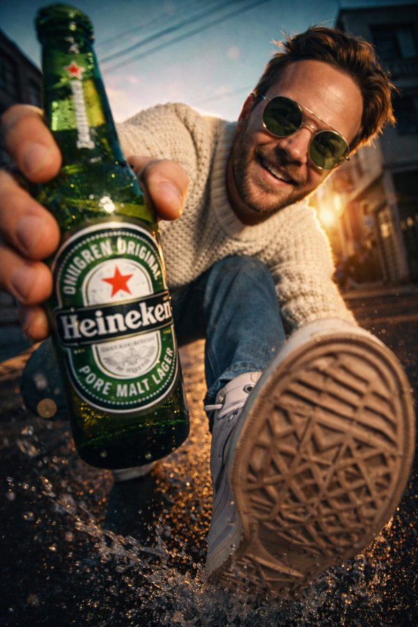

<!-- GENERATED from version JSON, sidecar metadata and personal corrections. Do not edit this reading copy. -->
# 街头炫瓶男模

[返回画廊总览](../../docs/gallery.md) · [版本与来源记录](case.json)

案例编号：`case-awesome-gpt-image-2-322-fe2ecd094f21` · 版本：`v1`

版本说明：首次收录

资料类型：案例 · 复核状态：未补充复核 / 待复核

复核说明：可替换人像模板需要用户提供模特图；prompt 包含 --v7 --style raw，不能据集合名称确认 GPT-image 生成，实际模型未知。 审核只涉及资料输入要求/资产角色，不包含重新生图、身份一致性或像素复现验证。

## 案例图片

### 图片 1 · 输出效果图

来源角色：`source_example`

角色依据：已看图，主体为提示词描述的完成后视觉示例；不从输出内容推定原始输入存在。



## 完整提示词

```text
[中文]
专业照片，一位男士，30岁的俄罗斯模特（参考图像），正对着镜头，向相机倾斜，从下往上拍摄，使用广角镜头。男士倾斜着身体，近距离将一瓶饮料展示给镜头，一只手拿着瓶子，紧贴在镜头前。瓶子的标签和方向保持笔直，以便标签清晰可读。他穿着白色运动鞋，一只脚在镜头前方。男士站在街道上，湿漉漉的沥青和飞溅的水花从下方拍出。鲜艳的色彩，电影级灯光，光线从后方打在模特的脸上。--v7 --ar 3:4 --style raw

[English]
Professional photo, a guy, a 30-year-old Russian model (reference image), is facing the lens, tilted towards the camera, angle from below, shot with a wide-angle lens. The guy is tilted and shows a bottle close-up to the camera, a hand with a bottle close-up right in front of the lens. The label and direction of the bottle are straight so the label is readable. He's wearing white sneakers, one foot in front of the camera. The guy is standing on the street, wet asphalt and splashes from below. Bright colors, cinematic lighting, the light is behind and on the model’s face. --v7 --ar 3:4 --style raw
```

[查看原始来源](https://x.com/ecommartinez/status/2017311074551533921)
