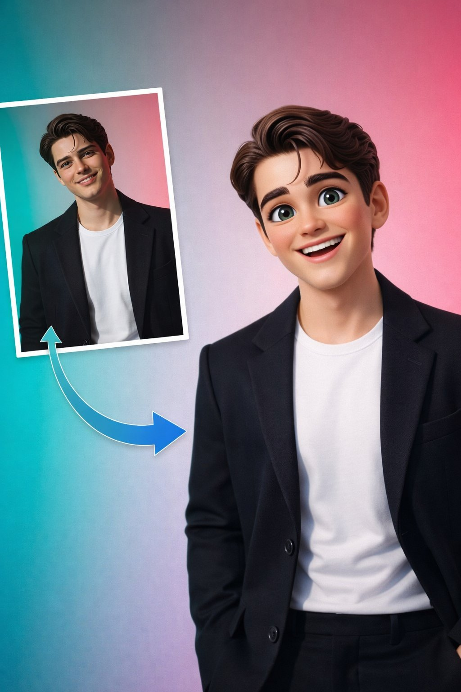

<!-- GENERATED from version JSON, sidecar metadata and personal corrections. Do not edit this reading copy. -->
# 皮克斯风阳光少年

[返回画廊总览](../../docs/gallery.md) · [版本与来源记录](case.json)

案例编号：`case-awesome-gpt-image-2-325-2d19ec404885` · 版本：`v1`

版本说明：首次收录

资料类型：案例 · 复核状态：未补充复核 / 待复核

复核说明：原图含左上写真人像插图、箭头和右侧卡通人物；prompt 仅描述卡通肖像，不能确定左图是原始输入还是示意，保留角色与流程疑点。已实际看样图并阅读完整 prompt；复核资料关系与输入条件，不代表生成复现或逐项事实准确性验收。

## 案例图片

### 图片 1 · mixed

来源角色：`source_example`

角色依据：原图含左上写真人像插图、箭头和右侧卡通人物；prompt 仅描述卡通肖像，不能确定左图是原始输入还是示意，保留角色与流程疑点



## 完整提示词

```text
[中文]
一个风格化的3D卡通肖像，一位年轻男子，拥有短棕发和富有表现力的绿色眼睛，温暖地微笑。他穿着黑色西装外套内搭白色T恤，现代休闲时尚。类似皮克斯/迪士尼风格角色设计，皮肤光滑，柔和光照，略微夸张的面部特征。高细节、精美的3D渲染，友好且平易近人的表情。渐变背景为柔和的蓝绿色和粉色，工作室灯光，浅景深，高分辨率。

[English]
A stylized 3D cartoon portrait of a young man with short brown hair and expressive green eyes, smiling warmly. He is wearing a black blazer over a white t-shirt, modern casual fashion. Pixar-like / Disney-style character design with smooth skin, soft lighting, and slightly exaggerated facial features. High detail, polished 3D render, friendly and approachable expression. Gradient background with soft teal and pink colors, studio lighting, shallow depth of field, high resolution.
```

[查看原始来源](https://x.com/iamsofiaijaz/status/2013473309485343120)
