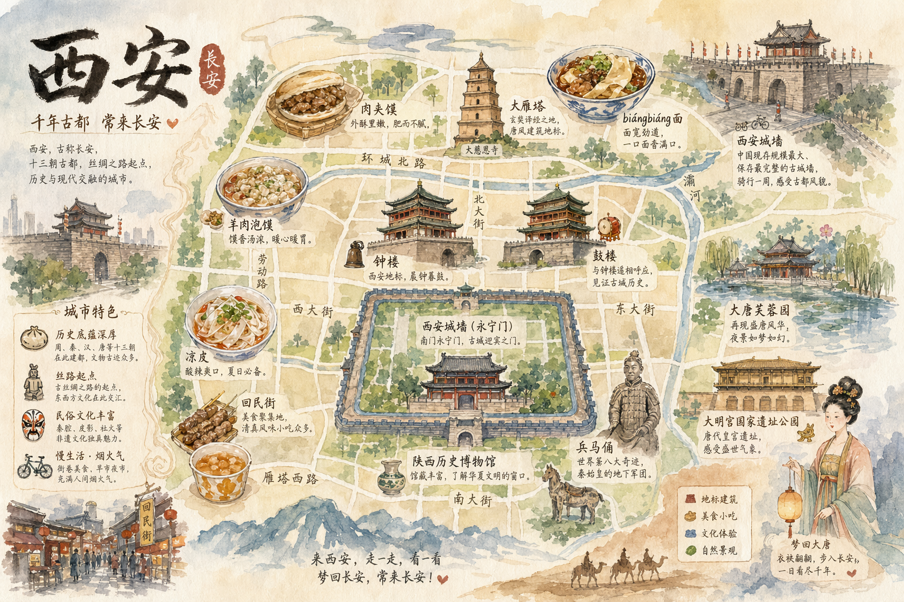

<!-- GENERATED from version JSON, sidecar metadata and personal corrections. Do not edit this reading copy. -->
# 西安手绘水彩城市地图

[返回画廊总览](../../docs/gallery.md) · [版本与来源记录](case.json)

案例编号：`case-awesome-gpt-image-2-331-8d64b90d0481` · 版本：`v1`

版本说明：首次收录

资料类型：案例 · 复核状态：已复核

复核说明：西安地标与美食的水彩地图。已阅读全文并查看样图，图片为结果示例；未发现必须补充某一指定输入图片。

## 案例图片

### 图片 1 · 输出效果图

来源角色：`source_example`

角色依据：西安地标与美食的水彩地图



## 完整提示词

```text
生成一张手绘水彩风格的「西安」城市地图，包含当地特色美食、地标建筑及城市特色
```

[查看原始来源](https://github.com/freestylefly/awesome-gpt-image-2/blob/main/docs/gallery-part-2.md#case-331)
