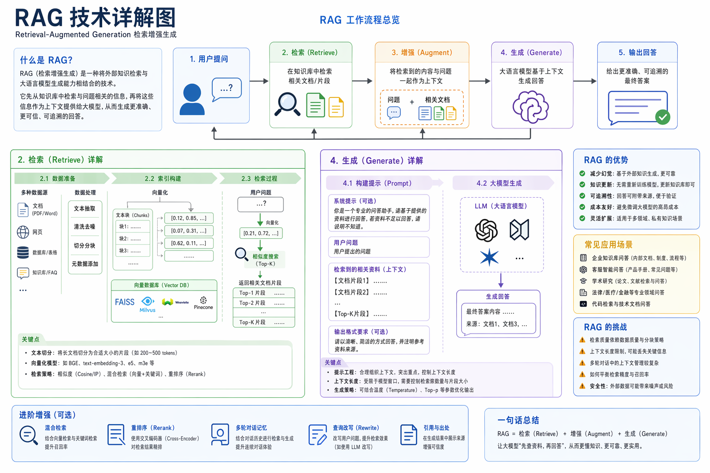

<!-- GENERATED from version JSON, sidecar metadata and personal corrections. Do not edit this reading copy. -->
# RAG 技术详解图

[返回画廊总览](../../docs/gallery.md) · [版本与来源记录](case.json)

案例编号：`case-awesome-gpt-image-2-334-80fee1aa2b68` · 版本：`v1`

版本说明：首次收录

资料类型：案例 · 复核状态：已复核

复核说明：实际查看：RAG流程、组件与注释的技术讲解图。已通读完整归档指令；图像为该创作方向的结果样例，文本未要求某张特定外部原图。

## 案例图片

### 图片 1 · 输出效果图

来源角色：`source_example`

角色依据：RAG流程、组件与注释的技术讲解图；完整指令对应的成品样例展示



## 完整提示词

```text
帮我生成一张 RAG 技术的详细讲解图
```

[查看原始来源](https://github.com/freestylefly/awesome-gpt-image-2/blob/main/docs/gallery-part-2.md#case-334)
