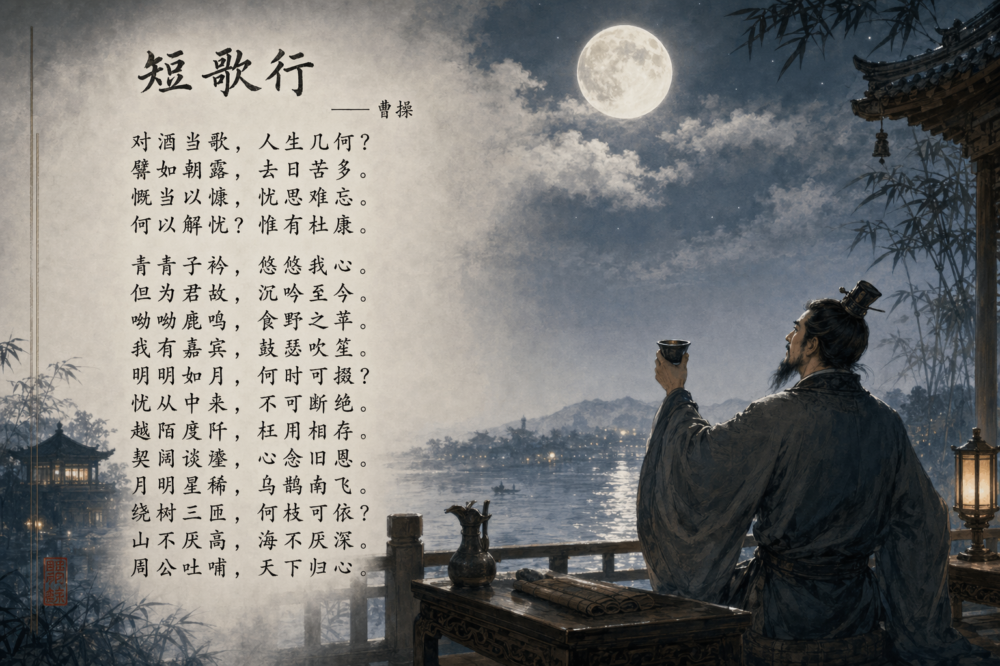

<!-- GENERATED from version JSON, sidecar metadata and personal corrections. Do not edit this reading copy. -->
# 《短歌行》诗词意境图

[返回画廊总览](../../docs/gallery.md) · [版本与来源记录](case.json)

案例编号：`case-awesome-gpt-image-2-337-4781279291a5` · 版本：`v1`

版本说明：首次收录

资料类型：案例 · 复核状态：已复核

复核说明：短歌行文字与举杯古人月景，诗词全文要求是输出文本。已实际看样图并阅读完整 prompt；复核资料关系与输入条件，不代表生成复现或逐项事实准确性验收。

## 案例图片

### 图片 1 · 输出效果图

来源角色：`source_example`

角色依据：短歌行文字与举杯古人月景，诗词全文要求是输出文本



## 完整提示词

```text
帮我生成一张《短歌行》的意境图，带整篇《短歌行》文字
```

[查看原始来源](https://github.com/freestylefly/awesome-gpt-image-2/blob/main/docs/gallery-part-2.md#case-337)
