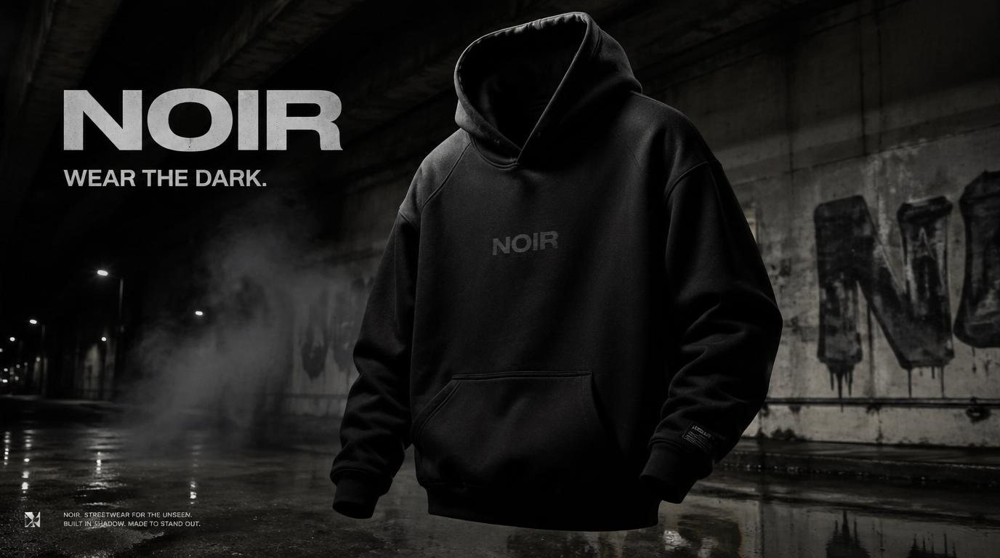

<!-- GENERATED from version JSON, sidecar metadata and personal corrections. Do not edit this reading copy. -->
# NOIR 街头服饰 Campaign

[返回画廊总览](../../docs/gallery.md) · [版本与来源记录](case.json)

案例编号：`case-awesome-gpt-image-2-344-a0291c56fadd` · 版本：`v1`

版本说明：首次收录

资料类型：案例 · 复核状态：已复核

复核说明：实际查看：NOIR黑色连帽衫与湿地面街头广告。已通读完整归档指令；图像为该创作方向的结果样例，文本未要求某张特定外部原图。

## 案例图片

### 图片 1 · 输出效果图

来源角色：`source_example`

角色依据：NOIR黑色连帽衫与湿地面街头广告；完整指令对应的成品样例展示



## 完整提示词

```text
Create a premium, highly realistic 1:1 campaign poster for NOIR, a modern streetwear brand. Show one hero oversized hoodie as the main focus against a gritty urban backdrop with wet concrete floors, dramatic low lighting, subtle smoke in the air and a raw street energy. Add bold minimal typography with the brand name NOIR and a short campaign headline like "Wear the Dark." Make it feel like a real high-end streetwear editorial, sharp detail, realistic fabric textures, modern and edgy, deep black tones with subtle grey accents, no clutter, no collage.
```

[查看原始来源](https://x.com/Daniel_adsss/status/2048542581638701446)
