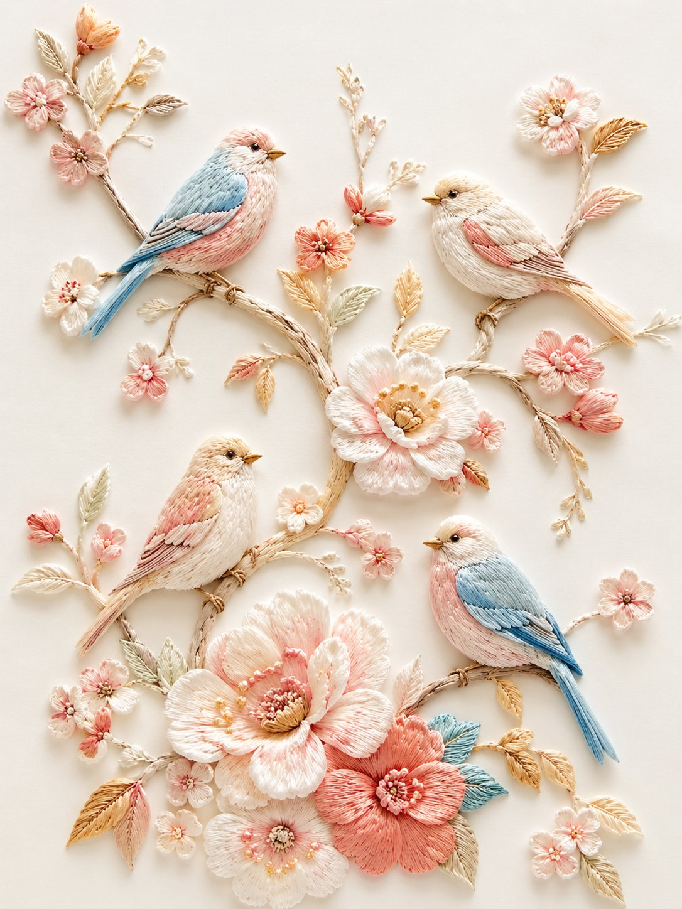

<!-- GENERATED from version JSON. Do not edit this reading copy. -->
# 立体刺绣小鸟花枝

[返回画廊总览](../../docs/gallery.md) · [版本与来源记录](case.json)

案例编号：`case-awesome-gpt-image-2-346-40ad00863d36` · 版本：`v1`

版本说明：首次收录

## 案例图片



## 完整提示词

```text
精致立体刺绣风插画，浅浮雕纤维艺术效果，纯净「蚕丝白 + 奶白」底色，细腻丝线质感。画面为数只小鸟停在蜿蜒花枝上，周围点缀粉白、浅桃、珊瑚粉、淡金色花朵与叶片，构图轻盈雅致、留白充足。鸟儿羽毛以奶白、浅蓝、淡粉、浅金丝线刺绣表现，花枝纤细自然，花朵层层叠线，整体呈现高级手工刺绣、丝线堆绣、柔和光影、细节丰富、温柔清新的艺术效果。
```

[查看原始来源](https://x.com/dotey/status/2048529821706195442)
