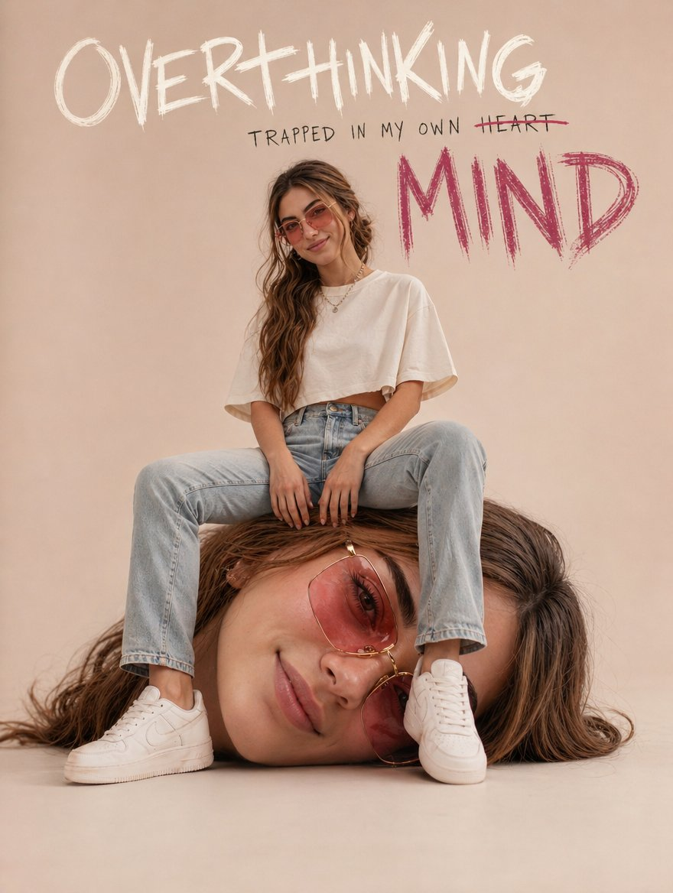

<!-- GENERATED from version JSON, sidecar metadata and personal corrections. Do not edit this reading copy. -->
# 过度思考超现实街头 Campaign

[返回画廊总览](../../docs/gallery.md) · [版本与来源记录](case.json)

案例编号：`case-awesome-gpt-image-2-356-ceefa59f3f53` · 版本：`v1`

版本说明：首次收录

资料类型：案例 · 复核状态：未补充复核 / 待复核

复核说明：已机械读取完整 prompt 与资产路径、哈希并比对本地上游画廊；未检出需补特定原图的明确证据。未全量逐图审，模型家族仅据来源集合声明，实际版本未知。 审核只涉及资料输入要求/资产角色，不包含重新生图、身份一致性或像素复现验证。

## 案例图片

### 图片 1 · 角色待复核

来源角色：`source_example`

角色依据：原始记录标 source_example；本轮未看此图，不能自动将其升级为已验证 output。



## 完整提示词

```text
Ultra-realistic conceptual portrait of a young woman with long wavy hair and soft defined features, wearing rose-tinted rectangular sunglasses, an oversized ivory cropped t-shirt, fitted light-wash denim jeans, and clean white sneakers. She is sitting casually with a confident yet relaxed posture.

The twist: she is seated on a large, hyper-realistic version of her own detached head placed on the ground. The head is scaled up, lying sideways, with the same facial features and sunglasses, creating a surreal self-reflection concept.

Composition: centered, full-body shot, neutral studio background with soft blush and cream tones, minimal aesthetic. Clean negative space.

Typography integrated into the background:

Handwritten-style text at the top: "OVERTHINKING"

Below it, smaller text: "TRAPPED IN MY OWN HEART" with "HEART" crossed out

Large, rough, scribbled text in deep pink: "MIND"

Lighting: soft diffused studio lighting, subtle shadows, high detail, fashion editorial quality.

Style: blend of surrealism and modern luxury streetwear campaign, pastel feminine aesthetic, minimal yet expressive, high-resolution, 8k, sharp focus, natural skin texture.

Mood: introspective, emotional weight, identity, self-awareness, quiet confidence.
```

[查看原始来源](https://x.com/AIwithAliya/status/2049044716642316758)
