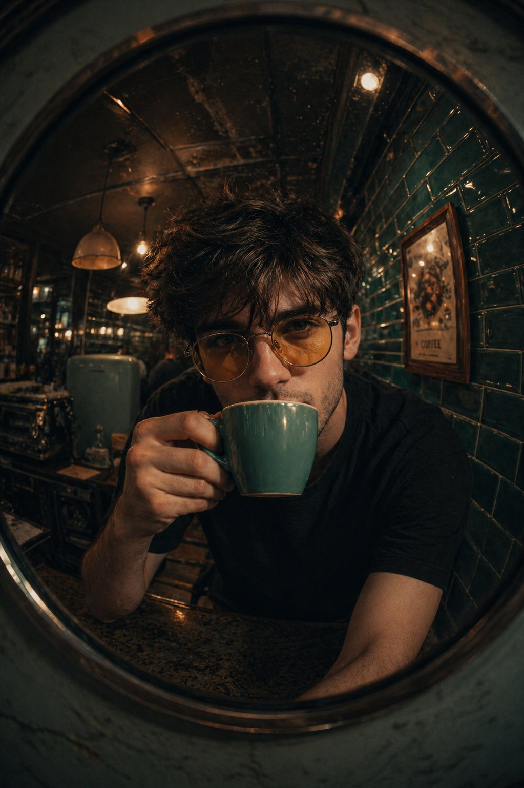

<!-- GENERATED from version JSON, sidecar metadata and personal corrections. Do not edit this reading copy. -->
# 鱼眼镜面复古咖啡馆人像

[返回画廊总览](../../docs/gallery.md) · [版本与来源记录](case.json)

案例编号：`case-awesome-gpt-image-2-357-a449ff04266c` · 版本：`v1`

版本说明：首次收录

资料类型：案例 · 复核状态：未补充复核 / 待复核

复核说明：已机械读取完整 prompt 与资产路径、哈希并比对本地上游画廊；未检出需补特定原图的明确证据。未全量逐图审，模型家族仅据来源集合声明，实际版本未知。 审核只涉及资料输入要求/资产角色，不包含重新生图、身份一致性或像素复现验证。

## 案例图片

### 图片 1 · 角色待复核

来源角色：`source_example`

角色依据：原始记录标 source_example；本轮未看此图，不能自动将其升级为已验证 output。



## 完整提示词

```text
A fish-eye lens close-up of [your photo as reference] sipping from a teal/turquoise coffee mug, leaning forward intimately toward camera. Shot through or near a round mirror. Retro café interior with glossy teal subway tiles, vintage appliances, pendant lights. Black t-shirt, yellow-tinted round glasses. Warm moody tones.
```

[查看原始来源](https://x.com/harboriis/status/2049044698900361241)
