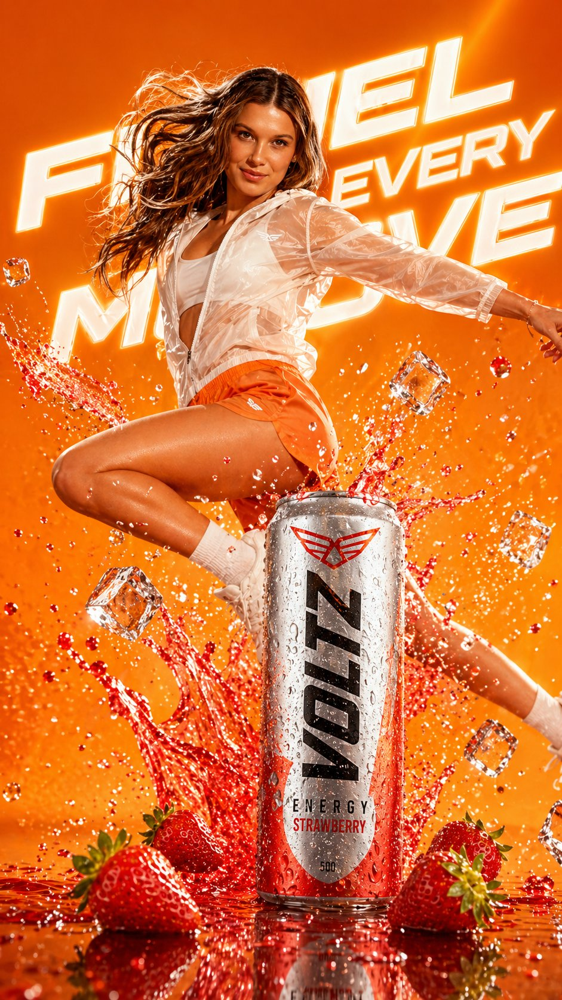

<!-- GENERATED from version JSON, sidecar metadata and personal corrections. Do not edit this reading copy. -->
# 草莓能量饮料商业广告

[返回画廊总览](../../docs/gallery.md) · [版本与来源记录](case.json)

案例编号：`case-awesome-gpt-image-2-358-8e0107b50e51` · 版本：`v1`

版本说明：首次收录

资料类型：案例 · 复核状态：未补充复核 / 待复核

复核说明：已复核检索命中上下文：其措辞指向输出布局、一般风格描述或可选资料，不构成指定输入文件要求。此例未逐图审，保留 needs_review；源图与源文已归档。 审核只涉及资料输入要求/资产角色，不包含重新生图、身份一致性或像素复现验证。

## 案例图片

### 图片 1 · 角色待复核

来源角色：`source_example`

角色依据：原始记录标 source_example；本轮未看此图，不能自动将其升级为已验证 output。



## 完整提示词

```text
A hyper-realistic commercial advertisement blending energy drink and sports branding. A dynamic athletic woman mid-air jump, wearing modern sportswear (light translucent jacket, orange shorts, white sneakers), surrounded by explosive splashes of red strawberry liquid and flying ice cubes. A cold metallic energy drink can (strawberry flavor) bursting with droplets sits in the foreground, covered in condensation. Fresh strawberries scattered on a glossy reflective surface.

Bright cinematic lighting with dramatic highlights and motion effects. Vibrant orange gradient background with bold glowing typography behind the subject. Ultra-detailed, high contrast, sharp focus, commercial product photography style, 8K resolution, advertising poster aesthetic, energetic, powerful, refreshing mood.
```

[查看原始来源](https://x.com/SPEEDAI07/status/2049043627163435040)
