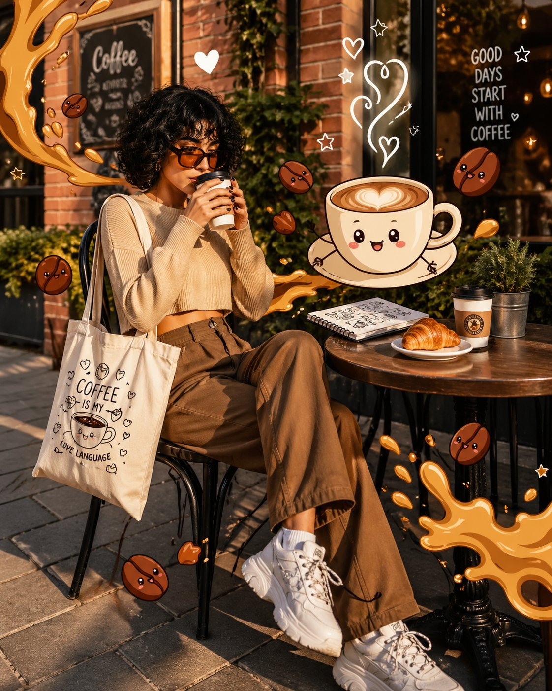

<!-- GENERATED from version JSON. Do not edit this reading copy. -->
# 咖啡馆写实照片与 2D 涂鸦叠加

[返回画廊总览](../../docs/gallery.md) · [版本与来源记录](case.json)

案例编号：`case-awesome-gpt-image-2-366-6fd3cdf6f1bc` · 版本：`v1`

版本说明：首次收录

## 案例图片



## 完整提示词

```text
A trendy young woman sitting at an outdoor café table, holding a hot coffee cup near her lips. She has short curly black hair and wears oversized tinted sunglasses, a cropped beige sweater, loose brown high-waisted pants, and chunky white sneakers. A tote bag with minimal coffee-themed illustrations hangs on her shoulder.

The scene blends realistic photography with playful 2D cartoon overlays. Floating around her are animated coffee elements: a smiling cappuccino cup with heart-shaped latte art, cute coffee beans with tiny faces, and stylized splashes of caramel forming comic-style shapes. Soft doodle steam rises into hearts and stars.

On the table: a croissant, a notebook with sketch drawings, and a second coffee cup.

Background: a realistic cozy café street with brick walls, plants, warm golden hour lighting, and soft shadows. Slight depth of field, subject in sharp focus.

Style: mix of photorealism and vibrant cartoon illustration, pop-art aesthetic, high saturation but warm tones, clean composition, Instagram-worthy, soft glow, 4k detail.
```

[查看原始来源](https://x.com/Jawad_Rahman_/status/2049796647237066971)
