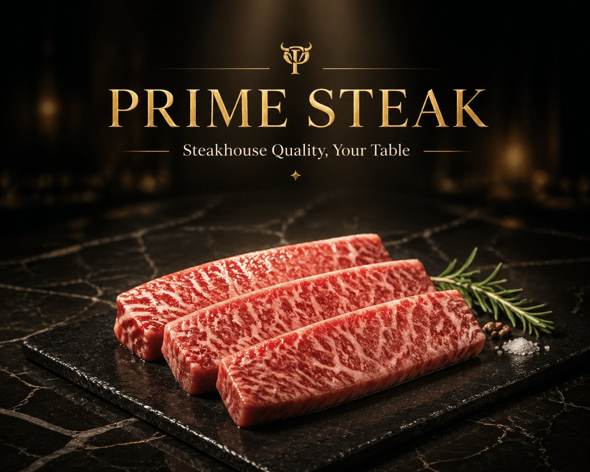

<!-- GENERATED from version JSON, sidecar metadata and personal corrections. Do not edit this reading copy. -->
# 高端肉类海鲜品牌英雄图

[返回画廊总览](../../docs/gallery.md) · [版本与来源记录](case.json)

案例编号：`case-awesome-gpt-image-2-373-643a2497b3ce` · 版本：`v1`

版本说明：首次收录

资料类型：案例 · 复核状态：已复核

复核说明：已实际看图并阅读全文。PRIME STEAK黑金品牌与肉排主视觉；商品名称、品牌等为必填文本槽，不是缺图片。 本次核对资料关系、图片角色和输入条件，不代表身份、事实或逐像素生成正确性验收。

## 案例图片

### 图片 1 · 输出效果图

来源角色：`source_example`

角色依据：PRIME STEAK黑金品牌与肉排主视觉；商品名称、品牌等为必填文本槽，不是缺图片。



## 完整提示词

```text
一、品牌基础设定
品牌名称：[请填写，例如：PRIME STEAK / OCEAN PRIME]
品牌标语：[请填写，例如：Steakhouse Quality, Your Table / Restaurant Grade, Home Delivered]
主色调：[请填写，例如：黑金 / 深红+金 / 深蓝+银]
字体风格：
标题：[请填写，例如：金色衬线体，大写，奢华感]
正文：[请填写，例如：细衬线体/无衬线体]
二、核心视觉元素
台面材质：[请填写，例如：大理石/黑色石板]
背景调性：[请填写，例如：深色渐变/暗调餐厅环境]
光线风格：[请填写，例如：聚光/侧光/顶部照明]
三、主产品定义（必填）
产品名称/类型：[请填写，例如：和牛牛排 / 帝王蟹 / 北极甜虾]
产品数量/摆放：[请填写，例如：1份单品 / 3块整齐摆放]
呈现方式：[请填写，例如：切片展示 / 带骨展示 / 原壳展示]
产品特色/质感提示：[请填写，例如：肉质纹理清晰、多汁感 / 光泽晶亮 / 肉眼可见油花]
```

[查看原始来源](https://x.com/xpg0970/status/2050108279385419965)
