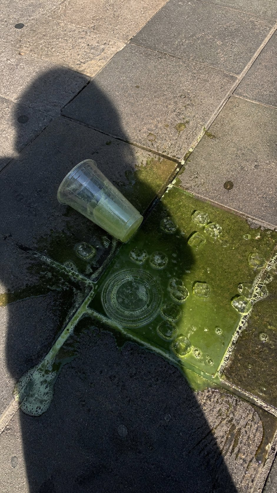

<!-- GENERATED from version JSON, sidecar metadata and personal corrections. Do not edit this reading copy. -->
# 泼洒抹茶街头手机照片

[返回画廊总览](../../docs/gallery.md) · [版本与来源记录](case.json)

案例编号：`case-awesome-gpt-image-2-376-90211482a3fa` · 版本：`v1`

版本说明：首次收录

资料类型：案例 · 复核状态：未补充复核 / 待复核

复核说明：已机械读取完整 prompt 与资产路径、哈希并比对本地上游画廊；未检出需补特定原图的明确证据。未全量逐图审，模型家族仅据来源集合声明，实际版本未知。 审核只涉及资料输入要求/资产角色，不包含重新生图、身份一致性或像素复现验证。

## 案例图片

### 图片 1 · 角色待复核

来源角色：`source_example`

角色依据：原始记录标 source_example；本轮未看此图，不能自动将其升级为已验证 output。



## 完整提示词

```text
A realistic vertical smartphone photo of a spilled green iced drink on outdoor stone pavement, a transparent disposable plastic cup lying on its side inside the green puddle, clear plastic lid nearby, scattered ice cubes floating in the drink, small foam bubbles on the surface, green liquid naturally spreading across rough square floor tiles, strong midday sunlight, harsh realistic shadows, a dark human shadow silhouette cast across the ground and partially over the spill, accidental street moment, urban documentary photography, handheld phone camera perspective, slightly top-down angle, natural colors, realistic pavement texture, raw unedited photo look, high detail, authentic everyday scene, 9:16 vertical composition

Negative Prompt:
cartoon, illustration, anime, CGI, 3D render, fantasy style, studio lighting, overly perfect composition, overly clean floor, fake liquid, unrealistic reflections, plastic-looking liquid, oversaturated green, blurry, low resolution, distorted cup, melted plastic, extra cups, duplicated objects, readable brand logo, messy text, watermark, poster design, dramatic artificial lighting, excessive sharpening, over-processed, unrealistic shadow, floating ice, deformed perspective
```

[查看原始来源](https://x.com/Shinning1010/status/2050693240253214894)
