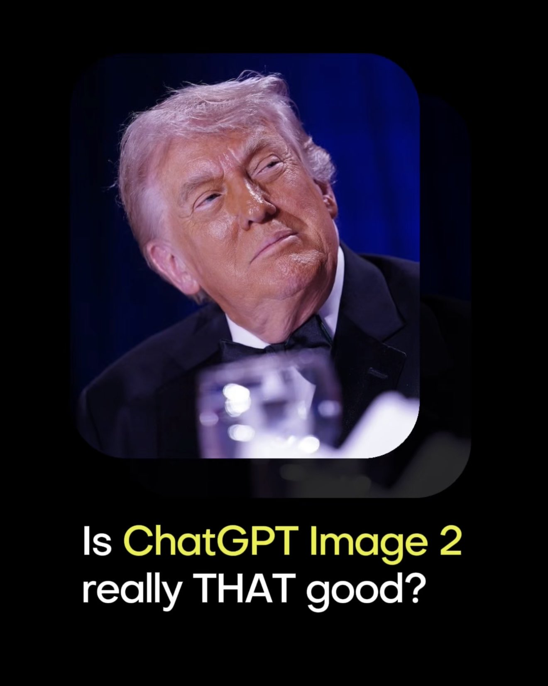

<!-- GENERATED from version JSON. Do not edit this reading copy. -->
# 高端 3D 收藏玩具头像

[返回画廊总览](../../docs/gallery.md) · [版本与来源记录](case.json)

案例编号：`case-awesome-gpt-image-2-378-7af4982cfca2` · 版本：`v1`

版本说明：首次收录

## 案例图片



## 完整提示词

```text
Transform the input photo into a high-end stylized 3D collectible figure. Large head, slightly exaggerated facial features while preserving identity. Hyper-detailed skin texture with subtle pores, realistic wrinkles, and a cinematic expression.

Smooth matte vinyl finish. Soft studio lighting, clean black background. Ultra-sharp focus, 8K render, photorealistic materials, Pixar-quality rendering, centered composition, full body, premium designer toy aesthetic.
```

[查看原始来源](https://x.com/Genematicai/status/2050654848216109429)
