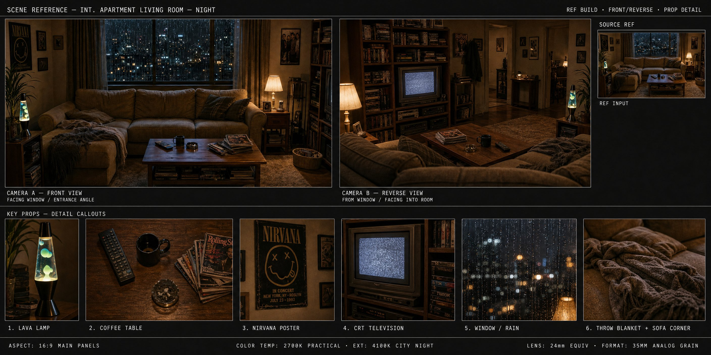

<!-- GENERATED from version JSON, sidecar metadata and personal corrections. Do not edit this reading copy. -->
# 90 年代公寓场景参考板

[返回画廊总览](../../docs/gallery.md) · [版本与来源记录](case.json)

案例编号：`case-awesome-gpt-image-2-381-9efc20798ac2` · 版本：`v1`

版本说明：首次收录

资料类型：案例 · 复核状态：未补充复核 / 待复核

复核说明：已机械读取完整 prompt 与资产路径、哈希并比对本地上游画廊；未检出需补特定原图的明确证据。未全量逐图审，模型家族仅据来源集合声明，实际版本未知。 审核只涉及资料输入要求/资产角色，不包含重新生图、身份一致性或像素复现验证。

## 案例图片

### 图片 1 · 角色待复核

来源角色：`source_example`

角色依据：原始记录标 source_example；本轮未看此图，不能自动将其升级为已验证 output。



## 完整提示词

```text
{
  "type": "scene reference board — 90s apartment living room, cinematic night",
  "style": "cinematic film photography, 35mm grain, warm amber shadow fill, deep chiaroscuro lighting, hyper-detailed interior, production design reference quality",
  "layout": {
    "main_panel_center_left": {
      "label": "CAMERA A — FRONT VIEW",
      "scene": "Wide shot, L-shaped tan sectional sofa, grey knit throw blanket, wooden coffee table (remote, mug, ashtray, Rolling Stone stack), lava lamp left, table lamp right, rain-streaked city window behind, Nirvana poster left wall. 35mm grain."
    },
    "main_panel_center_right": {
      "label": "CAMERA B — REVERSE VIEW",
      "scene": "Wide reverse from behind sofa. CRT TV prominent right, grey static screen. Tall bookshelf, VHS tapes. Cool blue backlight from window behind camera. Deep shadow."
    },
    "prop_strip_bottom": "6 close-up tiles: 1. LAVA LAMP — chrome base, blue-green wax blobs; 2. COFFEE TABLE — remote, mug, ashtray, magazines; 3. NIRVANA POSTER — black smiley face, wall texture; 4. CRT TELEVISION — static screen, VHS stack; 5. WINDOW/RAIN — city bokeh, water streaks; 6. THROW BLANKET — sofa corner, worn upholstery",
    "top_right_inset": "SOURCE REF thumbnail — original photo",
    "footer": "2700K PRACTICAL · 4100K CITY NIGHT · 24mm · 35MM"
  },
  "background": "deep charcoal #1a1a1a, thin white separators",
  "dimensions": "wide landscape 3:1, high resolution"
}
```

[查看原始来源](https://x.com/Iancu_ai/status/2051287273581203888)
