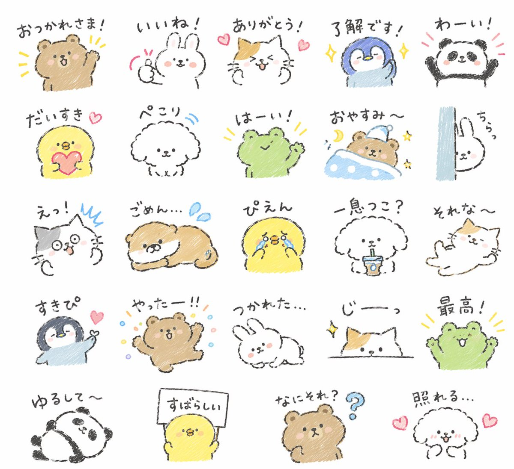

<!-- GENERATED from version JSON. Do not edit this reading copy. -->
# 综合应用场景图

[返回画廊总览](../../docs/gallery.md) · [版本与来源记录](case.json)

案例编号：`case-awesome-gpt-image-2-39-d32b7749886e` · 版本：`v1`

版本说明：首次收录

## 案例图片



## 完整提示词

```text
Create {argument name="quantity" default="24"} LINE stickers of {argument name="animals" default="animals"} in a quirky hand-drawn style. Target {argument name="target audience" default="Japanese Gen Z"} with a trendy style that can aim for top downloads.
```

[查看原始来源](https://x.com/midori_tatsuta)
