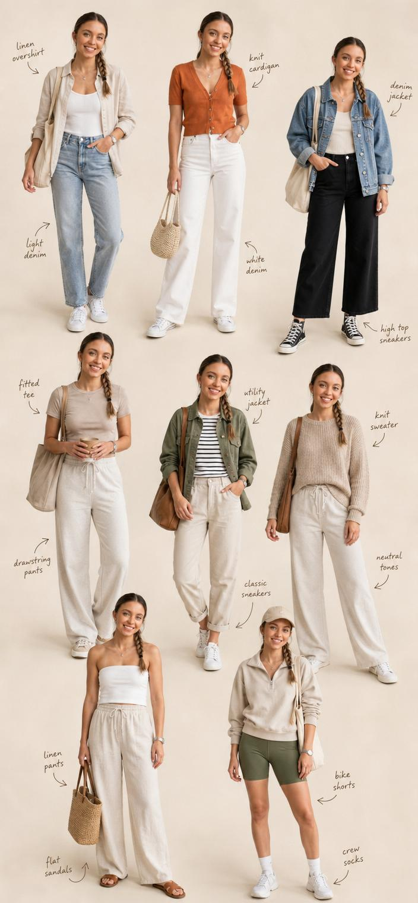

<!-- GENERATED from version JSON, sidecar metadata and personal corrections. Do not edit this reading copy. -->
# 8 套日常穿搭编辑拼贴

[返回画廊总览](../../docs/gallery.md) · [版本与来源记录](case.json)

案例编号：`case-awesome-gpt-image-2-398-a6ef2d6c07e1` · 版本：`v1`

版本说明：首次收录

资料类型：案例 · 复核状态：已复核

复核说明：已实际看图并阅读全文。八套女性穿搭自由拼贴；me和height为复用主体条件，保持本人脸需另供自己的照片，未指名特定归档源图。 本次核对资料关系、图片角色和输入条件，不代表身份、事实或逐像素生成正确性验收。

## 案例图片

### 图片 1 · 输出效果图

来源角色：`source_example`

角色依据：八套女性穿搭自由拼贴；me和height为复用主体条件，保持本人脸需另供自己的照片，未指名特定归档源图。



## 完整提示词

```text
Create a freeform fashion-editorial collage of me in 8 distinct full-body casual wear, arranged organically on a clean cream studio backdrop. Keep my face identical across all looks, w/ consistent proportions that visually read as around (height) w/o stating height. Include subtle handwritten-style arrows & labels highlighting key pieces. Avoid any grids, borders, or boxed layouts.
```

[查看原始来源](https://x.com/aiwithaly/status/2052218645951205463)
