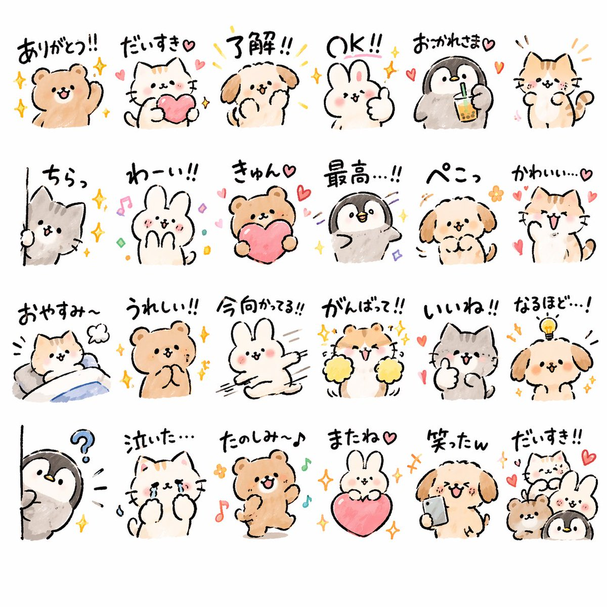

<!-- GENERATED from version JSON, sidecar metadata and personal corrections. Do not edit this reading copy. -->
# 综合应用场景图

[返回画廊总览](../../docs/gallery.md) · [版本与来源记录](case.json)

案例编号：`case-awesome-gpt-image-2-40-2502f87b984b` · 版本：`v1`

版本说明：首次收录

资料类型：案例 · 复核状态：已复核

复核说明：动物贴纸网格带日文短句，贴纸是同一结果版面。已实际看样图并阅读完整 prompt；复核资料关系与输入条件，不代表生成复现或逐项事实准确性验收。

## 案例图片

### 图片 1 · 输出效果图

来源角色：`source_example`

角色依据：动物贴纸网格带日文短句，贴纸是同一结果版面



## 完整提示词

```text
Create {argument name="quantity" default="24"} LINE stickers of {argument name="animals" default="animals"} in a quirky hand-drawn style. Target {argument name="target audience" default="Japanese Gen Z"} with a trendy style that can aim for top downloads.
```

[查看原始来源](https://x.com/midori_tatsuta)
