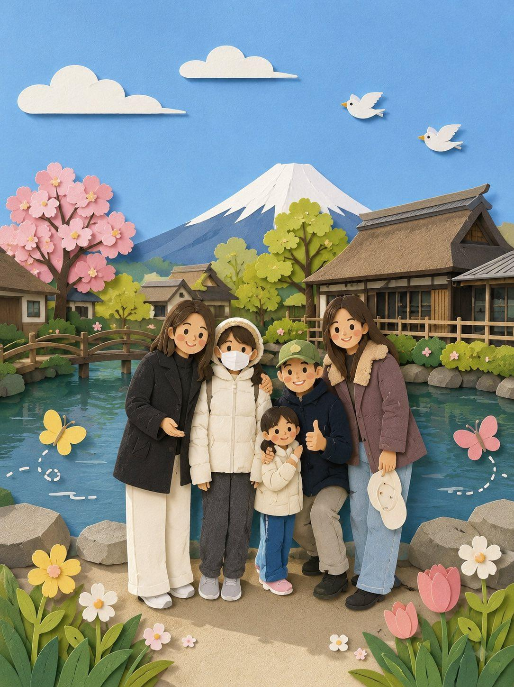

<!-- GENERATED from version JSON. Do not edit this reading copy. -->
# 可爱纸艺风照片重绘

[返回画廊总览](../../docs/gallery.md) · [版本与来源记录](case.json)

案例编号：`case-awesome-gpt-image-2-405-3c0ce979501b` · 版本：`v1`

版本说明：首次收录

## 案例图片



## 完整提示词

```text
Recreate this image in a paper craft style, simplifying the details to make them suitable for paper craft artwork. Arrange the overall composition to feel visually pleasing, soft, and cute. You may add charming decorative elements such as birds, butterflies, flowers, etc., to enhance the adorable atmosphere while still matching the original image.
```

[查看原始来源](https://x.com/oggii_0/status/2052609040539328759)
