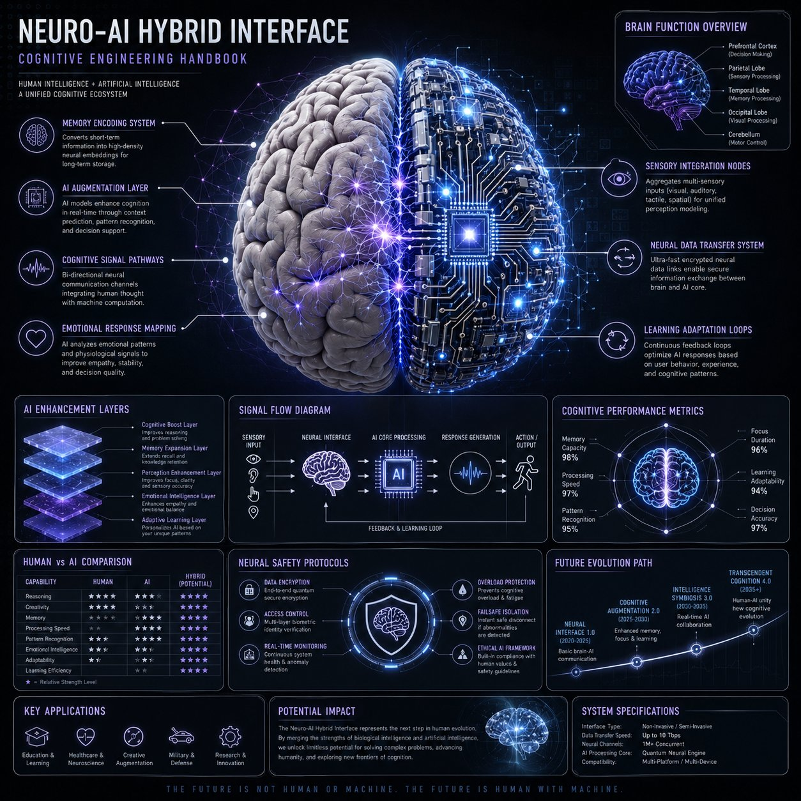

<!-- GENERATED from version JSON, sidecar metadata and personal corrections. Do not edit this reading copy. -->
# Neuro-AI 混合系统信息图

[返回画廊总览](../../docs/gallery.md) · [版本与来源记录](case.json)

案例编号：`case-awesome-gpt-image-2-407-c3462fa14d36` · 版本：`v1`

版本说明：首次收录

资料类型：案例 · 复核状态：未补充复核 / 待复核

复核说明：已机械读取完整 prompt 与资产路径、哈希并比对本地上游画廊；未检出需补特定原图的明确证据。未全量逐图审，模型家族仅据来源集合声明，实际版本未知。 审核只涉及资料输入要求/资产角色，不包含重新生图、身份一致性或像素复现验证。

## 案例图片

### 图片 1 · 角色待复核

来源角色：`source_example`

角色依据：原始记录标 source_example；本轮未看此图，不能自动将其升级为已验证 output。



## 完整提示词

```text
Create a premium square “neuro-AI hybrid system infographic” designed as a scientific cognitive engineering handbook page.

Visual Direction:
• 1:1 composition
• dark neutral background with glowing neural network overlays
• palette: electric blue, violet, soft white, silver
• elegant scientific typography and modular panels
• central ultra-detailed human brain + AI circuit fusion render

Main Subject:
A realistic human brain merging with AI neural networks and digital circuitry.

Include callouts:
• memory encoding system
• AI augmentation layer
• cognitive signal pathways
• emotional response mapping
• sensory integration nodes
• neural data transfer system
• learning adaptation loops

Modules:
• Brain Function Overview
• AI Enhancement Layers
• Signal Flow Diagram
• Cognitive Performance Metrics
• Human vs AI Comparison Chart
• Neural Safety Protocols
• Future Evolution Path

Style:
“neuroscience + AI engineering manual”, “high-end cognitive systems diagram”
```

[查看原始来源](https://x.com/YaZoraiz/status/2052968427514708371)
