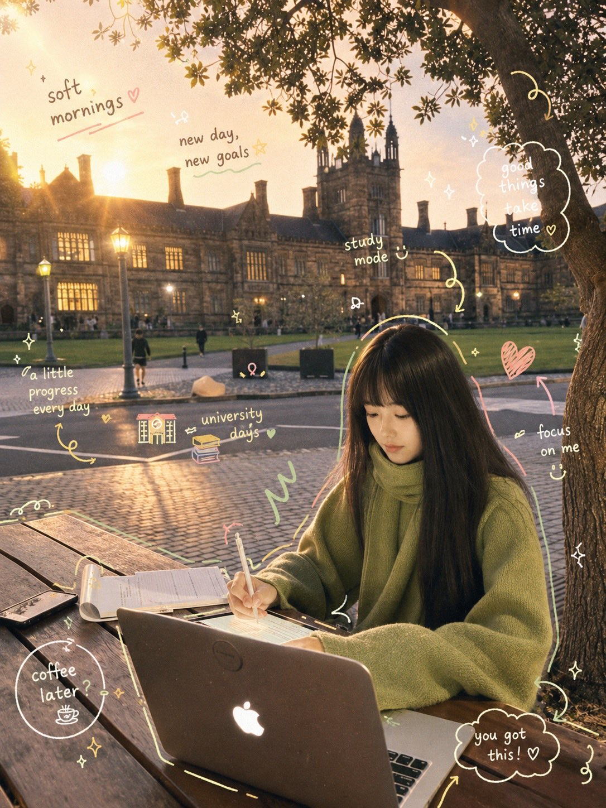

<!-- GENERATED from version JSON, sidecar metadata and personal corrections. Do not edit this reading copy. -->
# Cozy Academia 学习手记

[返回画廊总览](../../docs/gallery.md) · [版本与来源记录](case.json)

案例编号：`case-awesome-gpt-image-2-408-34f348815b45` · 版本：`v1`

版本说明：首次收录

资料类型：案例 · 复核状态：未补充复核 / 待复核

复核说明：已机械读取完整 prompt 与资产路径、哈希并比对本地上游画廊；未检出需补特定原图的明确证据。未全量逐图审，模型家族仅据来源集合声明，实际版本未知。 审核只涉及资料输入要求/资产角色，不包含重新生图、身份一致性或像素复现验证。

## 案例图片

### 图片 1 · 角色待复核

来源角色：`source_example`

角色依据：原始记录标 source_example；本轮未看此图，不能自动将其升级为已验证 output。



## 完整提示词

```text
Dreamy cinematic study aesthetic, young Asian girl with long dark hair studying outdoors at a wooden table during golden hour, cozy oversized green sweater and scarf, writing in notebook beside open laptop, historic university campus in background, warm sunset lighting, soft glow, autumn atmosphere, aesthetic doodles and handwritten notes floating around image, kawaii scrapbook style overlays, pastel hearts and stars, motivational text, shallow depth of field, nostalgic film grain, soft beige and warm green tones, peaceful productive vibe, ultra detailed, Pinterest aesthetic, photorealistic, cozy academia style, 35mm film look
```

[查看原始来源](https://x.com/Sairah_0/status/2052969695406325875)
