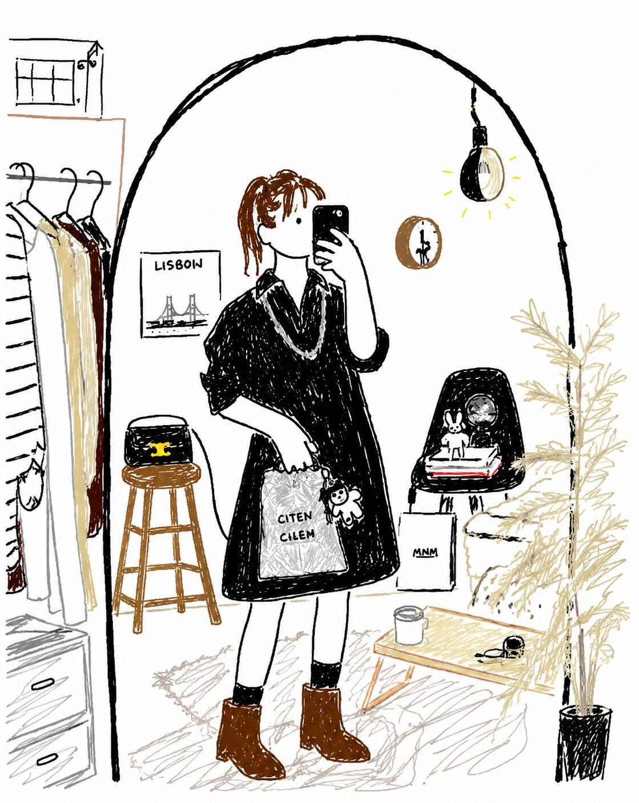

<!-- GENERATED from version JSON. Do not edit this reading copy. -->
# 拙劣 MS Paint 风重绘

[返回画廊总览](../../docs/gallery.md) · [版本与来源记录](case.json)

案例编号：`case-awesome-gpt-image-2-409-8069a10bd1c0` · 版本：`v1`

版本说明：首次收录

## 案例图片



## 完整提示词

```text
Please redraw the attached image in the most clumsy, messy, and hopelessly pathetic way possible. Use a white background and make it look like it was drawn in MS Paint with a mouse. It should vaguely resemble the original, but not really — like it’s kind of correct in some places yet strangely off and awkward overall. Emphasize a low-quality, pixelated look, and make it appear ridiculously badly drawn. …Actually, never mind — just draw it however you want in a sloppy way.
```

[查看原始来源](https://x.com/Ciri_ai/status/2052969749878059362)
