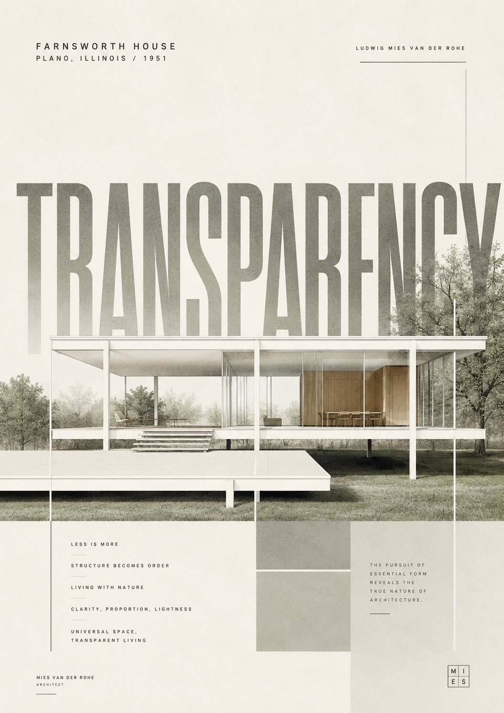

<!-- GENERATED from version JSON. Do not edit this reading copy. -->
# 极简建筑地标海报

[返回画廊总览](../../docs/gallery.md) · [版本与来源记录](case.json)

案例编号：`case-awesome-gpt-image-2-411-dbfbaacc0750` · 版本：`v1`

版本说明：首次收录

## 案例图片



## 完整提示词

```text
Design a luxury minimalist poster centered on a famous architectural landmark of your choice ([building name]). The focal element is an illustrated rendering of the building. Behind it, place one giant bold English word in a design-forward typeface whose character matches the building's identity, with smaller body copy nearby describing its design philosophy. The composition should read as an ultra high-end art poster. Use a restrained, low-key color palette where graphic elements interlock with the architecture, appearing as if they form part of its structural components or extend outward from its silhouette.
```

[查看原始来源](https://x.com/iamaiistudio/status/2053084576520573269)
