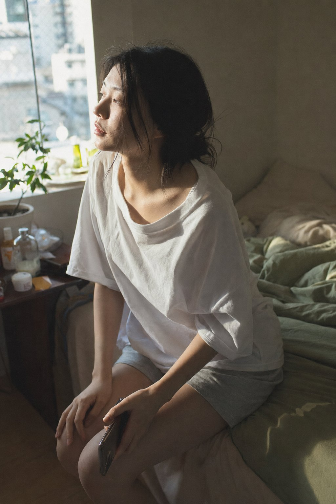

<!-- GENERATED from version JSON, sidecar metadata and personal corrections. Do not edit this reading copy. -->
# 室内晨间写实摄影

[返回画廊总览](../../docs/gallery.md) · [版本与来源记录](case.json)

案例编号：`case-awesome-gpt-image-2-414-aedd2c37c04b` · 版本：`v1`

版本说明：首次收录

资料类型：案例 · 复核状态：已复核

复核说明：晨间床边女子与窗光，未要求某张人物原照。已实际看样图并阅读完整 prompt；复核资料关系与输入条件，不代表生成复现或逐项事实准确性验收。

## 案例图片

### 图片 1 · 输出效果图

来源角色：`source_example`

角色依据：晨间床边女子与窗光，未要求某张人物原照



## 完整提示词

```text
A close-medium shot of a young Japanese woman in her bedroom on an ordinary morning, captured in authentic daily life photography as a natural candid moment. She is seated sideways on the edge of the bed, not fully awake yet, photographed from a slightly elevated three-quarter angle with cool-to-warm morning window light entering from the left.
East Asian young woman in her early 20s. Almond-shaped eyes with soft natural single eyelids, slightly elongated eye corners, still carrying the heaviness of just waking. Straight refined nose with a delicate bridge. Skin tone fair to light beige — skin subsurface scattering visible under the soft directional morning window light, specular micro-highlights catching gently on her cheekbone and nose ridge, fine skin texture perceptible, no makeup. Naturally straight fine black hair loosely gathered, slightly disheveled from sleep.
She wears a loose oversized cotton sleep shirt and soft shorts, nothing styled. Her gaze drifts toward the window, posture relaxed and unhurried, one hand resting on her knee, the other barely holding a phone face-down. The bedroom background suggests real life — slightly unmade linen, a potted plant near the window partially in shadow, small cluttered bedside items. Two or three stray hairs fall across her cheek in natural asymmetric displacement, not geometrically placed.
Soft directional morning light from a side window, cool-to-warm transition across her face and shoulder, long gentle shadows on the bedding behind her. The mood is quietly adrift — not sad, not performing, just suspended in the unhurried first minutes of the day. Subtle ISO 400 film grain in shadow areas, photographic noise texture not CG render smoothness. Aspect ratio 2:3. No watermark, no text overlay, not cartoon, not digitally painted, not illustration, not anime.
```

[查看原始来源](https://x.com/ToroJushiAi/status/2053078195482632421)
