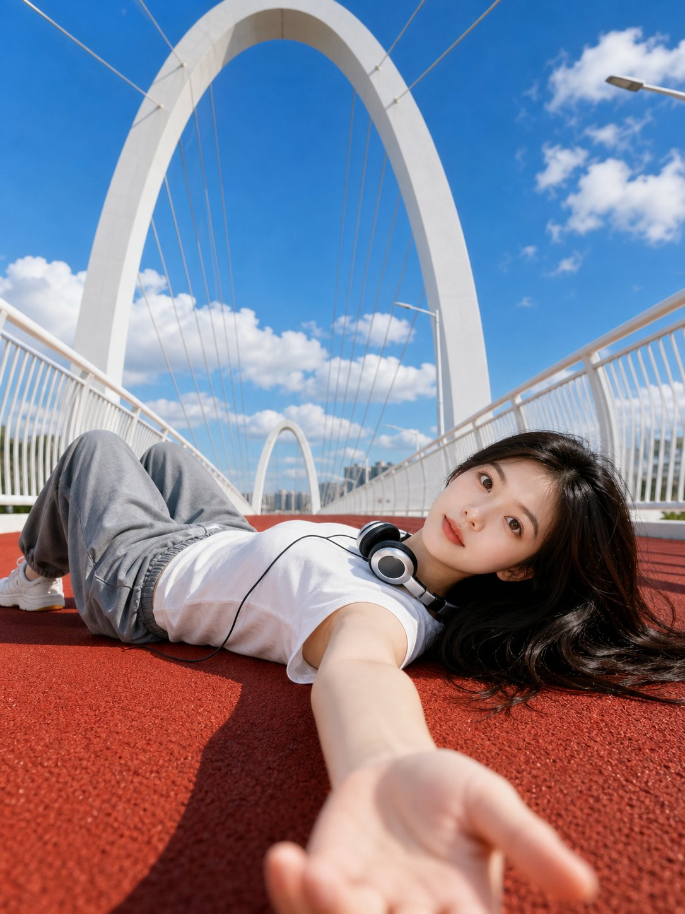

<!-- GENERATED from version JSON. Do not edit this reading copy. -->
# 红跑道低角度夏日人像

[返回画廊总览](../../docs/gallery.md) · [版本与来源记录](case.json)

案例编号：`case-awesome-gpt-image-2-420-b887d4d6e268` · 版本：`v1`

版本说明：首次收录

## 案例图片



## 完整提示词

```text
Use the uploaded portrait photo as the appearance reference for the person. Create a bright photorealistic outdoor portrait of a young woman lying on a red running track on a modern white arch pedestrian bridge. Ultra-wide low-angle selfie perspective, her arm reaching toward the camera in the foreground, relaxed pose, wired headphones around her neck, white sleeveless top, loose gray pants, black hair spread on the ground. Clean blue sky with soft white clouds, strong midday sunlight, crisp shadows, high clarity, fresh youthful mood, architectural symmetry, realistic skin texture, cinematic composition, 3:4 vertical image

Negative Prompt:

watermark, logo, text, caption, signature, AI label, extra fingers, deformed hands, distorted face, wrong identity, duplicate person, blurry face, low resolution, over-smoothed skin, plastic skin, unnatural anatomy, bad perspective, messy background, harsh artifacts, overexposure, underexposure
```

[查看原始来源](https://x.com/Shinning1010/status/2053521749967352285)
