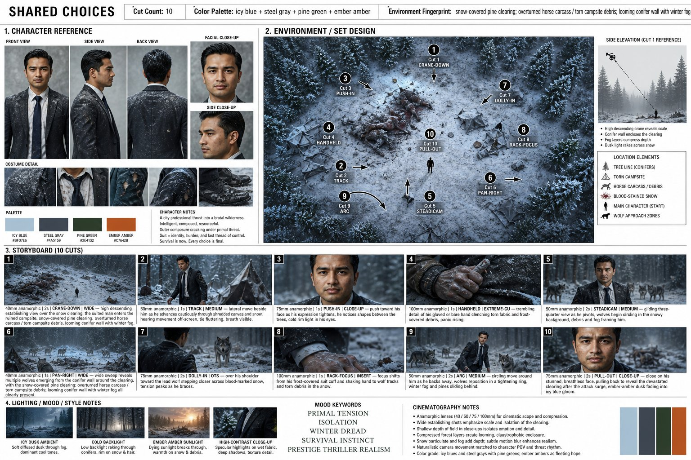

<!-- GENERATED from version JSON, sidecar metadata and personal corrections. Do not edit this reading copy. -->
# 冬季生存惊悚 Storyboard

[返回画廊总览](../../docs/gallery.md) · [版本与来源记录](case.json)

案例编号：`case-awesome-gpt-image-2-422-7ee0ffbaff3e` · 版本：`v1`

版本说明：首次收录

资料类型：案例 · 复核状态：未补充复核 / 待复核

复核说明：已机械读取完整 prompt 与资产路径、哈希并比对本地上游画廊；未检出需补特定原图的明确证据。未全量逐图审，模型家族仅据来源集合声明，实际版本未知。 审核只涉及资料输入要求/资产角色，不包含重新生图、身份一致性或像素复现验证。

## 案例图片

### 图片 1 · 角色待复核

来源角色：`source_example`

角色依据：原始记录标 source_example；本轮未看此图，不能自动将其升级为已验证 output。



## 完整提示词

```text
Cinematic Survival Thriller Storyboard Prompt

Create a premium cinematic storyboard presentation sheet for a prestige winter survival thriller.
Ultra-detailed professional film pre-production layout, clean editorial design, grayscale blueprint background with labeled sections and technical annotations.
Aspect ratio 16:9 horizontal master board.

SHARED CHOICES HEADER

* Cut Count: 10
* Color Palette: icy blue + steel gray + pine green + ember amber
* Environment Fingerprint: snow-covered pine clearing, overturned horse carcass, torn campsite debris, looming conifer forest, drifting winter fog

---

1. CHARACTER REFERENCE

A realistic South Asian man in his early 30s wearing a dark charcoal business suit, white dress shirt, black tie, polished black shoes.
Snow dusted across shoulders and hair.
Calm but haunted expression.
Show:

* front view
* side profile
* back view
* facial close-up
* side close-up
* costume fabric detail
* damaged sleeve detail
* shoes in snow

Character notes:
“An intelligent city professional trapped in a brutal wilderness.
Outer composure slowly cracks under primal fear.
Suit = identity, burden, and last thread of control.”

Palette swatches:

* icy blue
* steel gray
* pine green
* ember amber

---

2. ENVIRONMENT / SET DESIGN

Top-down aerial map of a snowy forest clearing at dusk.
Dead horses partially buried in snow.
Destroyed campsite tents.
Blood trails across frozen ground.
Dense dark pine trees forming a claustrophobic wall around the clearing.
Heavy winter fog drifting through the forest.

Add cinematic camera movement markers:

1. Crane-down
2. Track
3. Push-in
4. Handheld
5. Steadicam
6. Pan-right
7. Dolly-in
8. Rack-focus
9. Arc shot
10. Pull-out

Include arrows and overhead cinematic blocking diagram.

Side elevation panel:

* descending crane shot
* fog layers
* silhouette scale reference
* conifer enclosure composition

Location elements legend:

* tree line
* torn campsite
* horse carcass debris
* blood-stained snow
* main character
* wolf approach zones

---

3. STORYBOARD (10 CUTS)

CUT 1

Wide aerial crane-down shot over frozen clearing.
Tiny suited man surrounded by devastation.
Moody blue dusk lighting.

CUT 2

Tracking medium shot beside the man walking cautiously through snow and ripped tents.
Wind moving fabric debris.

CUT 3

75mm close-up push-in on face.
Cold breath visible.
Fear slowly emerging in his eyes.

CUT 4

Extreme close-up handheld shot of trembling hand gripping torn frozen fabric near blood-covered snow.

CUT 5

Steadicam medium shot revealing wolves emerging between trees behind him.

CUT 6

Pan-right wide shot sweeping across forest edge.
Multiple wolf silhouettes visible in fog.

CUT 7

Over-the-shoulder dolly-in toward alpha wolf approaching slowly through snow.

CUT 8

Rack-focus insert shot shifting focus from frozen hand to wolf tracks in snow.

CUT 9

Arc shot circling around the man as wolves tighten formation.
Snow and pine branches moving in icy wind.

CUT 10

Close-up pull-out shot from his exhausted face revealing the full massacre behind him in fading ember dusk light.

---

4. LIGHTING / MOOD / STYLE NOTES

* icy dusk ambience
* cold blue backlight
* ember sunset glow fading through fog
* wet fabric specular highlights
* cinematic volumetric fog
* snow particles drifting through frame
* high-contrast prestige thriller realism

Mood keywords:

* isolation
* winter dread
* survival instinct
* prestige thriller realism
* primal tension
* psychological fear

Cinematography notes:

* anamorphic lenses (40mm / 50mm / 75mm / 100mm)
* shallow depth of field
* compressed forest layers
* natural handheld movement
* realistic snow atmosphere
* cinematic Hollywood survival thriller aesthetic
* ultra detailed
* photorealistic
* film grain
* 8k production design board
* premium movie pitch deck style
```

[查看原始来源](https://x.com/zulkarnaimx/status/2053723774680535538)
