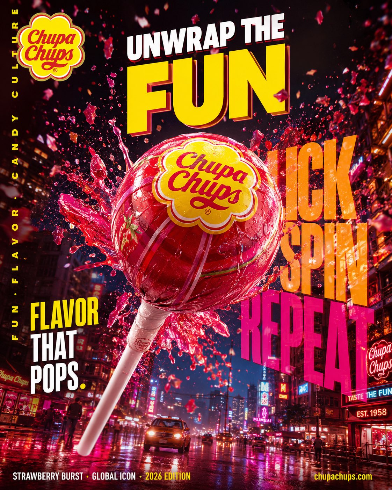

<!-- GENERATED from version JSON. Do not edit this reading copy. -->
# FMCG 棒棒糖霓虹广告

[返回画廊总览](../../docs/gallery.md) · [版本与来源记录](case.json)

案例编号：`case-awesome-gpt-image-2-424-4a123a5a5c99` · 版本：`v1`

版本说明：首次收录

## 案例图片



## 完整提示词

```text
Hyper-realistic cinematic FMCG billboard advertising poster for Chupa Chups India, focusing on playful energy, bold flavor explosion, and Gen-Z candy culture.

Scene: a giant glossy Chupa Chups lollipop floating above a vibrant Indian street at night, candy shards and liquid flavor bursts exploding outward mid-air.

Environment: neon-lit urban backdrop inspired by Mumbai nightlife, glowing signage, reflective wet streets, colorful haze.

Subject: oversized strawberry swirl lollipop as the hero object, ultra-detailed glossy texture, cinematic flavor splash motion.

Visual storytelling: iconic Chupa Chups flower logo glowing subtly on wrapper, reflections visible on wet surfaces and candy syrup splashes.

Composition: dramatic low-angle shot, giant centered product dominating frame, dynamic explosion spreading diagonally across billboard composition.

Typography:
top left — Chupa Chups logo.
center massive — “UNWRAP THE FUN” ultra bold playful typography.
behind product (oversized layered text) — “LICK / SPIN / REPEAT”.
mid-left — “FLAVOR THAT POPS.” bold condensed font.
bottom left — “STRAWBERRY BURST · GLOBAL ICON · 2026 EDITION”.
bottom right — “http://chupachups.com”.
left vertical edge — “FUN · FLAVOR · CANDY CULTURE”.

Typography style: playful bold sans-serif, glossy layered opacity, oversized billboard scale.

Color palette: vibrant reds, yellows, pinks, neon orange accents, glossy candy textures.

Lighting: dramatic neon backlight with glowing highlights and candy reflections.

Atmosphere: sugar particles, mist, syrup splashes, floating candy dust.

Mood: energetic, youthful, addictive, vibrant.

Shot on ARRI Alexa Mini LF, 35mm anamorphic, HDR, ultra cinematic, premium FMCG billboard style, 4:5 portrait.
```

[查看原始来源](https://x.com/Diplomeme/status/2054061713583219149)
