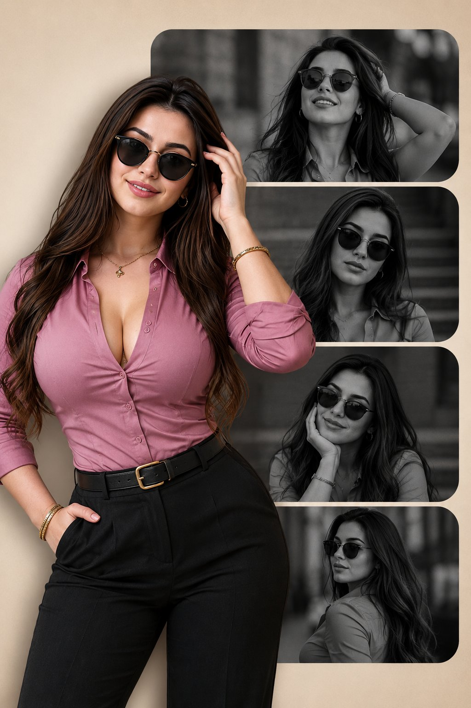

<!-- GENERATED from version JSON, sidecar metadata and personal corrections. Do not edit this reading copy. -->
# 黑白时尚人像拼贴海报

[返回画廊总览](../../docs/gallery.md) · [版本与来源记录](case.json)

案例编号：`case-awesome-gpt-image-2-425-d18c82ccb2dd` · 版本：`v1`

版本说明：首次收录

资料类型：案例 · 复核状态：已复核

复核说明：粉衣女性彩色主体与四个黑白墨镜肖像拼贴。已阅读全文并查看样图，图片为结果示例；未发现必须补充某一指定输入图片。

## 案例图片

### 图片 1 · 输出效果图

来源角色：`source_example`

角色依据：粉衣女性彩色主体与四个黑白墨镜肖像拼贴



## 完整提示词

```text
{
  "prompt": "Vertical poster collage design, beige background, four stacked horizontal rounded rectangles containing black and white cinematic portraits of the same young woman wearing sunglasses in different stylish poses. Foreground features a full-color high-quality cutout of the woman on the left side, wearing a pink mauve fitted shirt, black pants, sunglasses, confident cool pose, modern fashion editorial style, soft studio lighting, ultra realistic, premium magazine aesthetic, depth and shadow effects, clean minimal layout, 2:3 aspect ratio.",
  "aspect_ratio": "2:3"
}
```

[查看原始来源](https://x.com/XSydneyFan/status/2054054476429009086)
