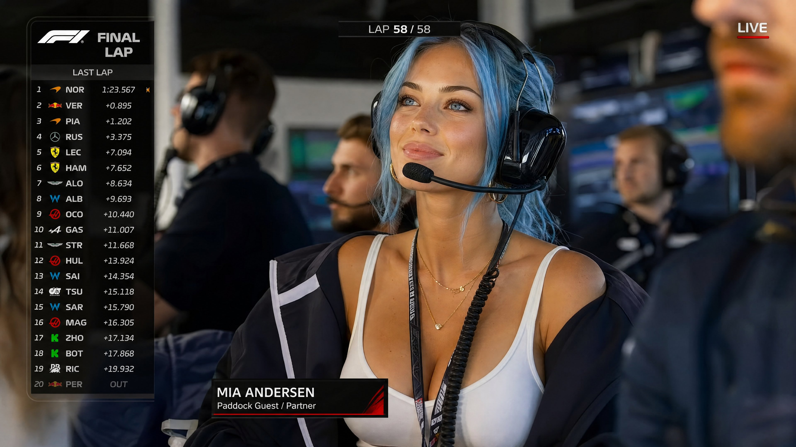

<!-- GENERATED from version JSON, sidecar metadata and personal corrections. Do not edit this reading copy. -->
# F1 直播转播围场截图

[返回画廊总览](../../docs/gallery.md) · [版本与来源记录](case.json)

案例编号：`case-awesome-gpt-image-2-428-1df0c5c4d071` · 版本：`v1`

版本说明：首次收录

资料类型：案例 · 复核状态：已复核

复核说明：实际查看：蓝发女性戴耳机与F1比赛直播信息叠层。已通读完整归档指令；图像为该创作方向的结果样例，文本未要求某张特定外部原图。

## 案例图片

### 图片 1 · 输出效果图

来源角色：`source_example`

角色依据：蓝发女性戴耳机与F1比赛直播信息叠层；完整指令对应的成品样例展示



## 完整提示词

```text
Ultra-realistic F1 live TV broadcast screenshot. A strikingly beautiful, 25-year-old young woman with bright light blue hair and captivating bright cerulean blue eyes is sitting in the VIP paddock / team garage during a Formula 1 race. Shown on the official live race broadcast as the girlfriend of an F1 driver, she is listening to the team radio through a professional racing headset. It is the final lap, and she is watching the garage monitors with a proud, enchanting smile.
She wears a fitted white tank top, an oversized racing team jacket (with generic, unbranded or blank team logos) draped over her shoulders, large black team-radio headset with boom mic, gold jewelry, and soft glam makeup. A slim, unbranded paddock pass hangs naturally from her neck.
Add realistic F1 broadcast graphics: "FINAL LAP" banner, lap counter showing final lap, driver timing tower on the left, small F1-style logo bug, "LIVE" indicator, and a lower-third identifying her as a driver partner / paddock guest (e.g., "MIA ANDERSEN - Paddock Guest / Partner"). No fake oversized badges, no selfie angle.
Team staff (in generic kit), headsets, garage screens, and generic race equipment are blurred around her. Telephoto broadcast camera shot from across the garage, professional depth of field, compression artifacts, digital noise, bright paddock lighting, natural skin texture, no smoothing, 8k quality, cinematic lighting.
```

[查看原始来源](https://x.com/bigwonbots/status/2054573714012787059)
