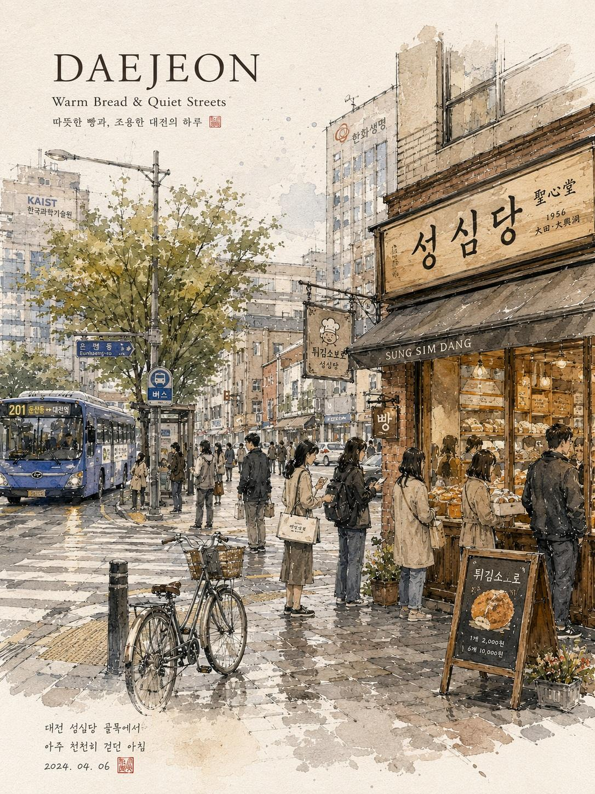

<!-- GENERATED from version JSON, sidecar metadata and personal corrections. Do not edit this reading copy. -->
# 韩国城市水彩旅行插画

[返回画廊总览](../../docs/gallery.md) · [版本与来源记录](case.json)

案例编号：`case-awesome-gpt-image-2-433-f0d68a2a63f9` · 版本：`v1`

版本说明：首次收录

资料类型：案例 · 复核状态：已复核

复核说明：DAEJEON 水彩街景旅行海报，咖啡店及行人场景与文本对应。已实际看样图并阅读完整 prompt；复核资料关系与输入条件，不代表生成复现或逐项事实准确性验收。

## 案例图片

### 图片 1 · 输出效果图

来源角色：`source_example`

角色依据：DAEJEON 水彩街景旅行海报，咖啡店及行人场景与文本对应



## 完整提示词

```text
Dreamy watercolor travel illustration of a peaceful Korean city street, hand-painted urban sketchbook style, delicate ink linework mixed with soft watercolor washes, cozy café storefronts, warm bakery lights glowing through windows, quiet morning atmosphere after light rain, reflective wet pavement, pedestrians with umbrellas and tote bags, bicycles parked along narrow streets, traditional Korean signs and typography, subtle Korean text labels, soft beige paper texture background, architectural sketch aesthetic, calm everyday city life, muted earthy palette with warm browns, faded greens, cream whites and soft blue accents, highly detailed pen-and-ink drawing, loose expressive brush strokes, travel journal composition, editorial postcard layout, elegant serif title text at top (“SEOUL”, “JEONJU”, “DAEJEON”), handwritten notes and date stamps, vintage travel diary aesthetic, cozy East Asian urban scenery, cinematic slice-of-life mood, watercolor bleeding edges, natural perspective, atmospheric depth, peaceful storytelling illustration, minimalist negative space, ultra detailed watercolor texture, sketchbook traveler aesthetic, nostalgic café culture vibes, Studio Ghibli-inspired realism, European urban sketching style mixed with Korean street scenery, soft daylight, calm and poetic composition, vertical poster design, premium art print quality.
```

[查看原始来源](https://x.com/Taaruk_/status/2055492435862773978)
