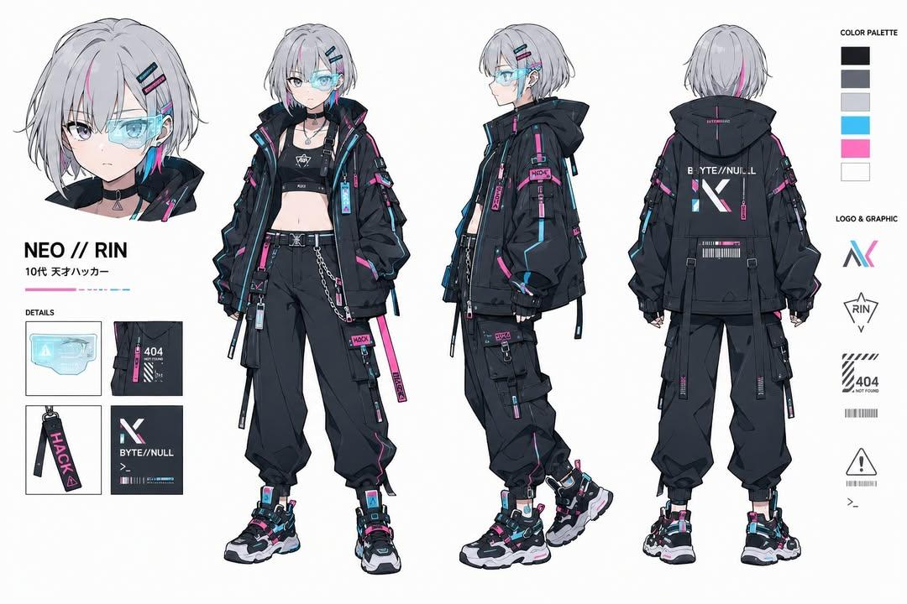

<!-- GENERATED from version JSON, sidecar metadata and personal corrections. Do not edit this reading copy. -->
# 赛博黑客角色设定表

[返回画廊总览](../../docs/gallery.md) · [版本与来源记录](case.json)

案例编号：`case-awesome-gpt-image-2-439-085cb12f9f61` · 版本：`v1`

版本说明：首次收录

资料类型：案例 · 复核状态：已复核

复核说明：银发赛博女孩正侧背、头像、配件与色板设定图。已阅读全文并查看样图，图片为结果示例；未发现必须补充某一指定输入图片。

## 案例图片

### 图片 1 · 输出效果图

来源角色：`source_example`

角色依据：银发赛博女孩正侧背、头像、配件与色板设定图



## 完整提示词

```text
Ultra-detailed cyberpunk anime character design sheet of a teenage genius hacker girl named “NEO // RIN”, full body turnaround (front, side, back) plus close-up portrait and accessory callouts. Short silver-white bob haircut with neon cyan and magenta gradient streaks, glowing translucent cyber visor over one eye, pale skin, sharp violet eyes, calm confident expression. Oversized techwear jacket with black tactical cargo pants, belts, straps, dangling utility tags, cropped top, futuristic sneakers, holographic accessories, barcode decals, warning symbols, “BYTE//NULL” typography, hacker aesthetic.
Color palette: matte black, dark gray, white, neon cyan, neon pink.
Style inspired by high-end Japanese concept art, futuristic streetwear, cyberpunk fashion, Akira + Ghost in the Shell + modern anime key visual aesthetics.
Include clean character reference sheet layout with labeled details, logo designs, UI graphics, gadget closeups, and color palette on white background.
Highly polished cel shading, crisp lineart, soft glow effects, intricate clothing folds, layered accessories, dynamic fashion silhouette, professional game concept art quality, 4k, ultra detailed.
```

[查看原始来源](https://x.com/Kashberg_0/status/2055865126335762902)
