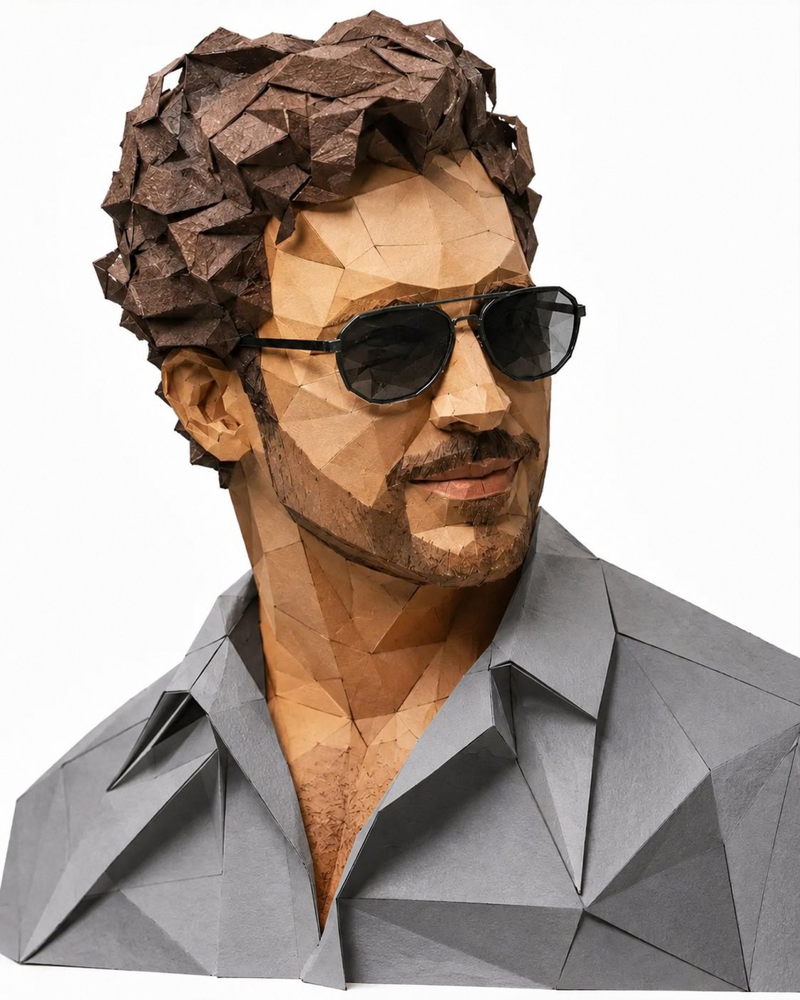

<!-- GENERATED from version JSON, sidecar metadata and personal corrections. Do not edit this reading copy. -->
# 低多边形纸艺男士肖像

[返回画廊总览](../../docs/gallery.md) · [版本与来源记录](case.json)

案例编号：`case-awesome-gpt-image-2-446-5932f2218650` · 版本：`v1`

版本说明：首次收录

资料类型：案例 · 复核状态：已复核

复核说明：实际查看：灰衣墨镜男子的折纸多边形肖像。已通读完整归档指令；图像为该创作方向的结果样例，文本未要求某张特定外部原图。

## 案例图片

### 图片 1 · 输出效果图

来源角色：`source_example`

角色依据：灰衣墨镜男子的折纸多边形肖像；完整指令对应的成品样例展示



## 完整提示词

```text
Create a highly detailed low-poly papercraft portrait of a stylish young man, designed like an origami paper sculpture. The character has curly dark brown hair, a trimmed beard, and wears slightly black-tinted geometric sunglasses with thin black frames. His shirt is medium grey with sharp polygonal folds and realistic paper texture. Use faceted angular shapes across the face, hair, and clothing, with realistic shadows and layered paper depth. Minimal clean white studio background, soft lighting, ultra-realistic paper craft aesthetic, modern geometric art style, high detail, centered composition, 8k quality.
```

[查看原始来源](https://x.com/iamsofiaijaz/status/2056953102755115162)
