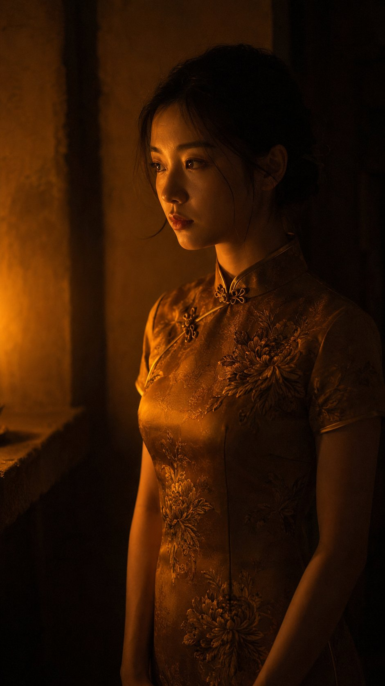

<!-- GENERATED from version JSON, sidecar metadata and personal corrections. Do not edit this reading copy. -->
# 烛光侧室写实摄影

[返回画廊总览](../../docs/gallery.md) · [版本与来源记录](case.json)

案例编号：`case-awesome-gpt-image-2-450-0d62948797bf` · 版本：`v1`

版本说明：首次收录

资料类型：案例 · 复核状态：未补充复核 / 待复核

复核说明：已机械读取完整 prompt 与资产路径、哈希并比对本地上游画廊；未检出需补特定原图的明确证据。未全量逐图审，模型家族仅据来源集合声明，实际版本未知。 审核只涉及资料输入要求/资产角色，不包含重新生图、身份一致性或像素复现验证。

## 案例图片

### 图片 1 · 角色待复核

来源角色：`source_example`

角色依据：原始记录标 source_example；本轮未看此图，不能自动将其升级为已验证 output。



## 完整提示词

```text
A medium-shot authentic daily life photograph, natural candid moment, of an East Asian young woman standing in a small side room lit only by a single candle on a low stone shelf. 85mm lens, waist-up framing, shallow depth of field. The candle is off-frame to the left; the room behind her exists only as dark warm suggestion.

East Asian young woman in her early 20s. Almond-shaped eyes receiving the candle's warm flicker — the irises briefly caught in light before returning to shadow. Straight refined nose, the bridge illuminated in a narrow warm stripe. Skin tone fair beige, warmed entirely by candlelight into something amber. Skin subsurface scattering visible under directional candlelight, specular micro-highlights on cheekbones and nose ridge, fine foundation powder grain perceptible.

She wears an aged amber silk qipao with chrysanthemum embroidery in tones of old bronze and dusty ochre — the amber pigment identical in temperature to the candle's own light, the embroidery appearing and disappearing depending on angle. Mandarin collar, short sleeves. She stands facing the candle without looking at it, arms at her sides, very still. The room is otherwise empty. Two or three stray hairs displaced by faint air movement, natural unplanned imperfection, not geometrically symmetrical.

Single candle — warm amber-orange, directional and fragile. It carves the left side of her face from darkness, leaves the right in near-black shadow. The amber qipao and the candlelight share a single temperature register: the room folds her into the light. Deep chiaroscuro with no artificial fill. Subtle ISO 400 film grain in shadow areas, photographic noise texture not CG render smoothness. Aspect ratio 9:16. No watermark, no text overlay, not cartoon, not digitally painted, not illustration, not anime.
```

[查看原始来源](https://x.com/ToroJushiAi/status/2056926887344042382)
