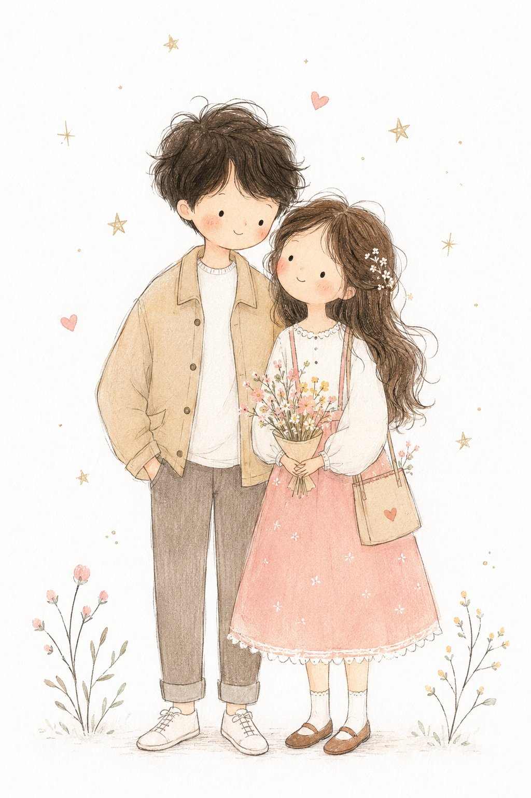

<!-- GENERATED from version JSON, sidecar metadata and personal corrections. Do not edit this reading copy. -->
# 极简童话手绘儿童插画

[返回画廊总览](../../docs/gallery.md) · [版本与来源记录](case.json)

案例编号：`case-awesome-gpt-image-2-452-755f950ef943` · 版本：`v1`

版本说明：首次收录

资料类型：案例 · 复核状态：已复核

复核说明：已核对原文输入要求与当前示例图；这是通用可替换主体/照片/标志模板，实际执行须由使用者提供相应输入，未发现必须另补某一指定源文件的明确要求。 审核只涉及资料输入要求/资产角色，不包含重新生图、身份一致性或像素复现验证。

## 案例图片

### 图片 1 · 输出效果图

来源角色：`source_example`

角色依据：已看图，主体为提示词描述的完成后视觉示例；不从输出内容推定原始输入存在。



## 完整提示词

```text
Transform the photo into a delicate minimalist hand-drawn children’s illustration with a soft whimsical fairy-tale aesthetic. Use simple elongated shapes, thin imperfect hand-drawn lines, flat pastel colors, minimal details, and a cute doll-like character style with rosy cheeks, tiny facial features, and simplified anatomy. Add subtle paper texture, soft pencil and pastel shading, watercolor softness, and a clean white background with small stars or sparkles.

Stylize the clothing in a playful storybook way with simplified shapes and gentle decorative details. The overall mood should feel airy, cozy, naive, and charming, like a modern Scandinavian nursery postcard or children’s book illustration. Avoid photorealism, 3D, cinematic lighting, glossy surfaces, complex shadows, realistic anatomy, and hyper-detail.
```

[查看原始来源](https://x.com/MissDelulu9/status/2057073936295399551)
