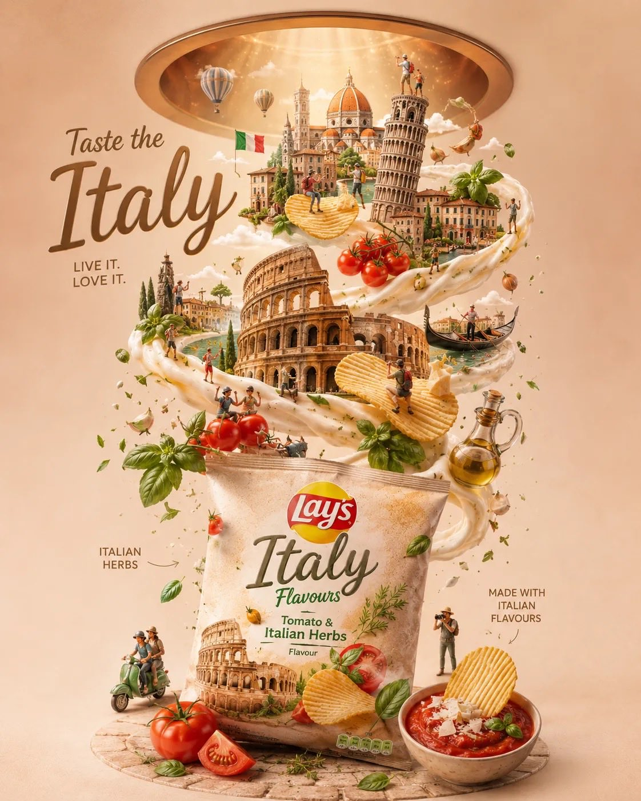

<!-- GENERATED from version JSON, sidecar metadata and personal corrections. Do not edit this reading copy. -->
# 旅行美食薯片广告海报

[返回画廊总览](../../docs/gallery.md) · [版本与来源记录](case.json)

案例编号：`case-awesome-gpt-image-2-454-4060118dc763` · 版本：`v1`

版本说明：首次收录

资料类型：案例 · 复核状态：未补充复核 / 待复核

复核说明：已机械读取完整 prompt 与资产路径、哈希并比对本地上游画廊；未检出需补特定原图的明确证据。未全量逐图审，模型家族仅据来源集合声明，实际版本未知。 审核只涉及资料输入要求/资产角色，不包含重新生图、身份一致性或像素复现验证。

## 案例图片

### 图片 1 · 角色待复核

来源角色：`source_example`

角色依据：原始记录标 source_example；本轮未看此图，不能自动将其升级为已验证 output。



## 完整提示词

```text
Ultra-detailed premium travel-food advertisement poster for [CITY/COUNTRY], vertical composition, inspired by luxury Lay’s-style chips advertising. A realistic chips packet placed at the bottom center as the main hero object, matching the exact premium commercial layout of a floating chips campaign.

A cinematic spiral ribbon of sauce, cream, clouds, steam, or flavored swirl rises upward from the chips packet, dynamically wrapping around iconic landmarks, local foods, and cultural elements from [CITY/COUNTRY].

Floating ridged potato chips suspended naturally throughout the spiral motion, interacting with the landmarks and miniature travelers. The chips packet design must feel authentic to [CITY/COUNTRY], featuring regional colors, typography, patterns, and local flavor inspiration while still clearly looking like a premium potato chips package.

Include only the most iconic landmarks from [CITY/COUNTRY], carefully spaced with clean composition and no clutter. Add miniature travelers naturally interacting with the environment:
- taking photos
- exploring landmarks
- sitting on floating chips
- riding local transport
- observing scenery
- walking through the swirl paths

Include authentic local foods, ingredients, and atmosphere elements relevant to [CITY/COUNTRY].

Background should be soft pastel or warm luxury gradient with a circular ceiling portal opening at the top emitting cinematic spotlight beams.

Elegant premium commercial lighting, soft shadows, floating particles, realistic depth, balanced negative space, luxury tourism campaign aesthetic, hyper-realistic CGI, highly detailed but minimalist, Instagram-worthy poster design.

Composition rules:
- one dominant centered chips packet
- floating ridged potato chips throughout composition
- one continuous upward spiral motion
- landmarks layered vertically
- miniature people sparse and intentional
- no duplicate landmarks
- no overcrowding
- clean premium hierarchy
- cinematic storytelling through scale contrast
- premium advertising composition matching high-end chips commercials
```

[查看原始来源](https://x.com/Naiknelofar788/status/2057282710469767241)
