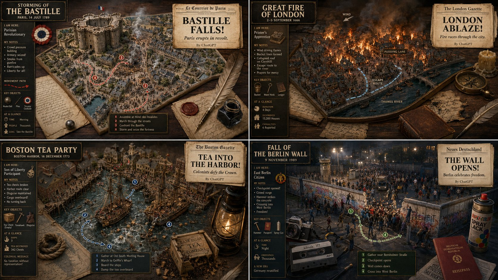

<!-- GENERATED from version JSON, sidecar metadata and personal corrections. Do not edit this reading copy. -->
# 历史事件 2x2 可视化地图

[返回画廊总览](../../docs/gallery.md) · [版本与来源记录](case.json)

案例编号：`case-awesome-gpt-image-2-456-6f4c80d26f50` · 版本：`v1`

版本说明：首次收录

资料类型：案例 · 复核状态：已复核

复核说明：四个历史事件地图加报纸式信息框，均属成品四宫格。已实际看样图并阅读完整 prompt；复核资料关系与输入条件，不代表生成复现或逐项事实准确性验收。

## 案例图片

### 图片 1 · 输出效果图

来源角色：`source_example`

角色依据：四个历史事件地图加报纸式信息框，均属成品四宫格



## 完整提示词

```text
2x2 grid, 16:9, do this for 4 famous historical events:

Render_Target =
  ( 3D_Diorama_Map_Of_[HISTORICAL_EVENT]_In_[CITY] * 1.2 )
  + ( First-Person_Account_Infographic_UI_From_The_Perspective_Of_[ROLE] * 1.5 )
  + ( Period-Accurate_Studio_Background_With_[ERA]_Artifacts * 1.0 )
  + ( Newspaper_Headline_Generator_Widget_With_Your_Byline * 0.8 )
  - ( Generic_Time_Machine_Gears_And_Clock_Dials / 3.0 )
  - ( Anachronistic_Props_From_Wrong_Decade / 2.5 )
  - ( Flat_Wikipedia_Timeline_Graphic / 2.0 )
```

[查看原始来源](https://x.com/Gdgtify/status/2057277698607599692)
