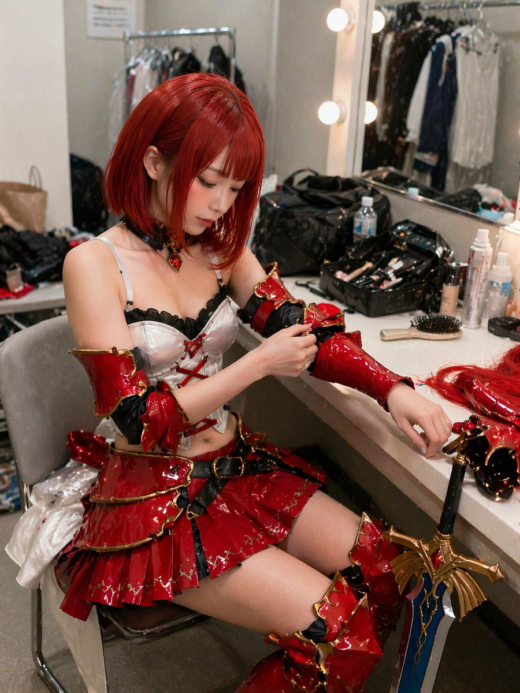

<!-- GENERATED from version JSON, sidecar metadata and personal corrections. Do not edit this reading copy. -->
# 建筑空间场景图

[返回画廊总览](../../docs/gallery.md) · [版本与来源记录](case.json)

案例编号：`case-awesome-gpt-image-2-46-2acc615a7769` · 版本：`v1`

版本说明：首次收录

资料类型：案例 · 复核状态：未补充复核 / 待复核

复核说明：已机械读取完整 prompt 与资产路径、哈希并比对本地上游画廊；未检出需补特定原图的明确证据。未全量逐图审，模型家族仅据来源集合声明，实际版本未知。 审核只涉及资料输入要求/资产角色，不包含重新生图、身份一致性或像素复现验证。

## 案例图片

### 图片 1 · 角色待复核

来源角色：`source_example`

角色依据：原始记录标 source_example；本轮未看此图，不能自动将其升级为已验证 output。



## 完整提示词

```text
A highly detailed, realistic photograph of a young East Asian woman sitting in a cluttered backstage dressing room, getting ready for a cosplay event. She has {argument name="hair color" default="vibrant short red"} hair styled in a bob with bangs and is wearing an elaborate fantasy warrior costume featuring a {argument name="costume color" default="glossy red"} and gold tiered mini skirt, a white corset top with black lace and red lacing, matching glossy arm guards, and thigh-high boots. She is looking down with a focused expression, using her right hand to adjust the arm guard on her left arm. The vanity counter in front of her is messy, covered with makeup brushes, bottles, a hairbrush, and extra hairpieces. A large, ornate {argument name="prop" default="fantasy sword with a blue blade and gold hilt"} leans against the edge of the counter. The background shows a brightly lit vanity mirror with round bulbs reflecting a clothing rack, capturing a candid, slightly over-sharpened, and highly textured photographic style.
```

[查看原始来源](https://x.com/lakeside529)
