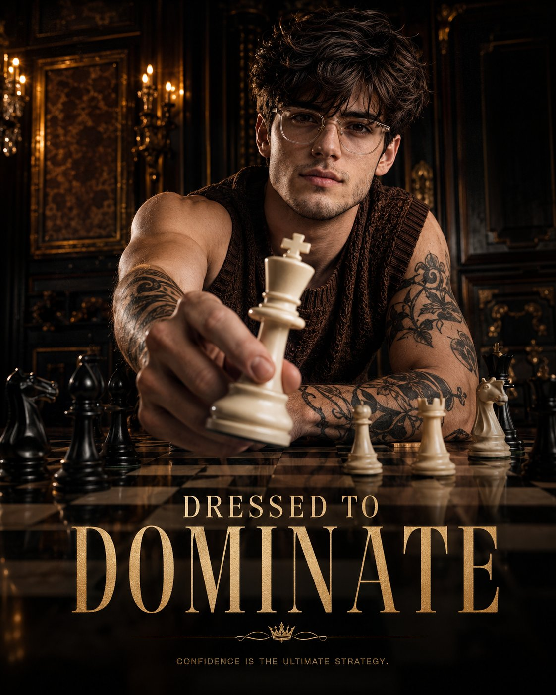

<!-- GENERATED from version JSON, sidecar metadata and personal corrections. Do not edit this reading copy. -->
# 棋盘低角度奢华男装 Campaign

[返回画廊总览](../../docs/gallery.md) · [版本与来源记录](case.json)

案例编号：`case-awesome-gpt-image-2-460-edc75f2d4003` · 版本：`v1`

版本说明：首次收录

资料类型：案例 · 复核状态：已复核

复核说明：男子低角度伸手持白色棋子与 DOMINATE 文案，成品广告构图。已实际看样图并阅读完整 prompt；复核资料关系与输入条件，不代表生成复现或逐项事实准确性验收。

## 案例图片

### 图片 1 · 输出效果图

来源角色：`source_example`

角色依据：男子低角度伸手持白色棋子与 DOMINATE 文案，成品广告构图



## 完整提示词

```text
Ultra-realistic luxury fashion campaign poster shot from a dramatic low-angle perspective across a glossy chessboard table. A stylish young male model with sharp facial features, textured curly hair, wearing thin luxury glasses and a fitted sleeveless knitted brown vest, leaning forward in a confident pose. One hand extended toward the camera holding a large white king chess piece in forced perspective, dominating the foreground. Tattooed arms visible, intense confident facial expression, direct eye contact. Elegant vintage royal interior background with dark paneled walls, warm chandelier wall lights, cinematic amber lighting, moody shadows, luxury editorial atmosphere. Chess pieces scattered on the board in foreground and background for depth. High contrast premium fashion advertising style, ultra-detailed skin texture, sharp focus on face and chess piece, shallow depth of field, glossy reflections on chessboard, dramatic commercial campaign photography, luxury menswear brand aesthetic. Bold typography at bottom saying “DRESSED TO DOMINATE”, premium poster layout, cinematic color grading, high-end fashion ad, editorial magazine quality, 4:5 aspect ratio.
```

[查看原始来源](https://x.com/harboriis/status/2058414859658956888)
