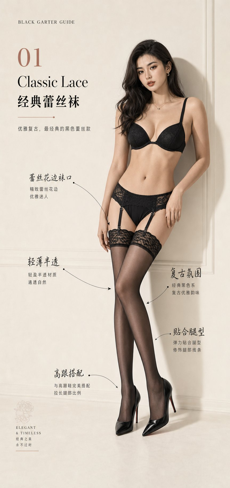

<!-- GENERATED from version JSON, sidecar metadata and personal corrections. Do not edit this reading copy. -->
# 黑色吊带袜单款图鉴展示

[返回画廊总览](../../docs/gallery.md) · [版本与来源记录](case.json)

案例编号：`case-awesome-gpt-image-2-463-fb5c5c2c7d44` · 版本：`v1`

版本说明：首次收录

资料类型：案例 · 复核状态：缺少必要输入

复核说明：已放大查看Classic Lace单款人物图，只有成品和款式注释。完整prompt明确要求与已完成总览图鉴保持完全统一并继续8款；本条资产中没有该指定总览图鉴，也只有一款样例。缺少被引用的前序总览输入，需关联已有总览或补入原资产。

## 案例图片

### 图片 1 · 输出效果图

来源角色：`source_example`

角色依据：Classic Lace经典蕾丝袜单款人物展示与箭头注释；完整指令对应的成品样例展示



## 完整提示词

```text
《黑色丝袜图鉴款式单图》提示词：

请基于同一套「黑色丝袜 / 吊带袜图鉴」系列风格，继续生成 8 张对应单款的独立展示图。

【系列要求】
- 这些图片必须和已完成的总览图鉴属于同一个系列
- 整体版式、字体、色调、背景、质感、排版逻辑保持一致
- 都是竖版、高完成度、暖白 / 浅灰白背景、轻奢女性向时尚图鉴风格
- 每一张都像同一个品牌或同一套视觉系统下的延展页面

【每张单图的共同结构】
1. 顶部标题区
- 英文系列标题：BLACK GARTER GUIDE
- 中文主标题：黑色丝袜 / 吊带袜单款展示
- 当前款式名称：__________
- 一句简短副标题：突出该款式的核心特点

2. 中部主体区
- 以 1 位成人女性模特穿戴展示为主
- 重点展示对应款式的关键细节：
  - 经典蕾丝款：袜口蕾丝、优雅氛围
  - 细网眼款：网格纹理、轻盈通透
  - 波点款：波点图案、复古俏皮
  - 后缝线款：背后缝线、线条感
  - 竖条纹款：纵向条纹、修饰腿型
  - 交叉绑带款：绑带结构、设计感
  - 极简透肤款：透明感、基础百搭
  - 花纹蕾丝款：花纹装饰、浪漫氛围
- 每张图的人物长相、发型、姿势、镜头角度要不同，但都要保持高级、真实、性感、写实
- 允许使用站姿、坐姿、交叉腿、倚靠、回眸等不同姿势
- 画面要有立体感、阴影层次和高级编辑感

3. 注释区
- 每张图都要保留 3 到 5 条手绘式标注
- 可以使用箭头、短线、圈注、手写风标签
- 标注内容要围绕该款式最关键的细节，比如：
  - 袜口结构
  - 花纹纹理
  - 透明度
  - 缝线位置
  - 绑带方式
  - 腿部线条效果
- 标注文字简洁、清楚、统一风格

4. 底部信息区
- 加入简短的 “Style Notes / 风格速记”
- 用 1 到 2 句说明该款适合的场景和氛围
- 保持简洁，不要抢主体

【统一视觉要求】
- 保持和总览图鉴完全统一的整体视觉系统
- 背景统一为暖白、浅灰白或奶白
- 风格统一为高级、干净、时尚图鉴感、轻奢女性视觉
- 模特必须真实、立体、写实、自然肤质
- 每张图都要突出产品，不要低俗，不要过度情色化
- 每张图都应像同一系列里的不同章节，避免呈现为彼此割裂的作品

【款式列表】
1. 经典蕾丝款 / Classic Lace
2. 细网眼款 / Fine Fishnet
3. 波点款 / Dot Sheer
4. 后缝线款 / Back Seam
5. 竖条纹款 / Stripe Sheer
6. 交叉绑带款 / Cross Strap
7. 极简透肤款 / Minimal Sheer
8. 花纹蕾丝袜 / Floral Lace

【输出目标】
按以上 8 个款式，分别生成 8 张独立展示图。
要求每张都保留统一系列感，同时人物造型、发型、姿势和镜头语言明显不同，确保整套看起来完整、专业、可收藏。
```

[查看原始来源](https://x.com/MrLarus/status/2058175014168396245)
