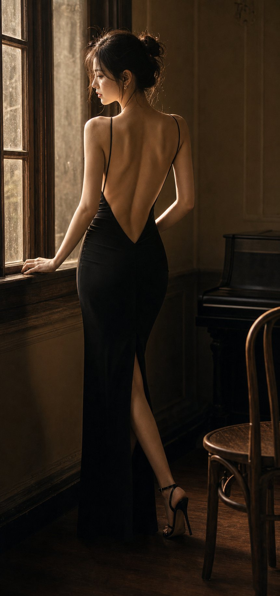

<!-- GENERATED from version JSON. Do not edit this reading copy. -->
# 逆光美背女性情绪写真

[返回画廊总览](../../docs/gallery.md) · [版本与来源记录](case.json)

案例编号：`case-awesome-gpt-image-2-465-2abb6e5c80af` · 版本：`v1`

版本说明：首次收录

## 案例图片



## 完整提示词

```text
逆光美背女性情绪写真提示词：

请生成一张竖版高质感女性情绪写真，主题为「逆光美背·女性情绪写真」。

核心要求：
画面的绝对重点是“美背”，通过露背结构、肩颈线条、肩胛骨、脊柱中线、腰背曲线和逆光轮廓来呈现女性美。请避免普通女性写真或普通穿搭图的处理方式，背部必须是主视觉核心，脸只作为辅助。

人物设定：
成年女性，真实自然，气质可为温柔、清冷、慵懒、文艺、轻熟或安静。人物不要网红脸，不要塑料感，不要夸张妆容。可侧脸、回眸、低头或闭眼，但正脸不是重点。

姿态要求：
姿态必须服务于背部展示，例如背对镜头微微回头、侧身站立、侧坐、抬手整理头发、低头蜷身、斜倚窗边、半躺回眸、披衣下滑等。动作自然，不要僵硬摆拍，不要正面直视镜头。

露背结构：
必须有明确的露背设计，可为低背长裙、吊带裙、露背礼服、针织外套滑落、薄纱披肩、浴袍半披、宽松衬衫滑肩、丝质罩衫半落等。重点表现肩线、肩胛骨、背中线、腰背收束和布料与肌肤之间的高级过渡。

服装与材质：
服装选择轻柔、垂坠、带有透光感和褶皱感的材质，如薄纱、真丝、针织、棉麻、细闪纱、浴袍质地、软垂感长裙。布料要参与构图，形成半遮半露、滑落、包裹、垂挂的层次，但不能厚重。

场景：
场景为卧室、窗边、床上、白墙房间、民宿、酒店房间、木质空间或复古公寓。背景简洁克制，少量床品、窗帘、木椅、花束、地板等元素即可，不能喧宾夺主。

光线要求：
采用自然光或柔和暖光，以逆光、侧逆光、窗边光为主。重点是让光打到背部，勾出肩颈边缘、肩胛骨轮廓、腰线和发丝高光。可使用晨光、黄昏金光、柔雾散射光或冷白窗光，但背部受光状态必须成立。

构图：
竖版构图，画幅可为 9:16、3:4 或 4:5。人物是绝对主角，视觉重心放在背部、肩颈和腰背曲线上。可采用半身、七分身、近景或全身，但不要让场景抢走主体。

氛围：
整体氛围安静、柔软、私密、克制、高级，像真实摄影师拍摄的电影感情绪写真。重点避免直白性感，改用“美背 + 逆光 + 柔软布料 + 自然姿态”表达女性美。

画质要求：
真实摄影感、电影感、柔雾胶片感、细腻肤色、真实皮肤质感、浅景深、轻微颗粒感、画面通透自然。不要 AI 塑料感，不要 CG 感，不要错误手指，不要肢体畸形，不要低俗色情化表达，不要文字、水印、Logo、边框。

最终效果：
一张以“美背”为主视觉核心的高完成度女性情绪写真，通过露背结构、肩颈背部线条、柔光逆光和柔软布料来呈现克制而高级的女性美。
```

[查看原始来源](https://x.com/MrLarus/status/2058131948904599860)
