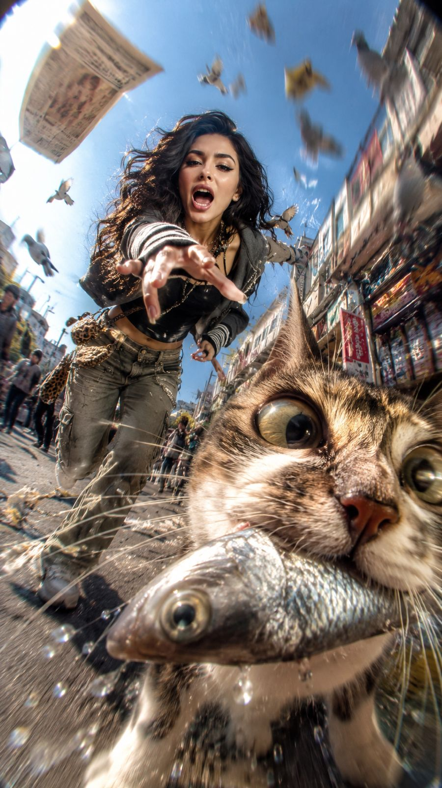

<!-- GENERATED from version JSON, sidecar metadata and personal corrections. Do not edit this reading copy. -->
# 鱼市追猫 CCD 街拍

[返回画廊总览](../../docs/gallery.md) · [版本与来源记录](case.json)

案例编号：`case-awesome-gpt-image-2-466-fe94a295f286` · 版本：`v1`

版本说明：首次收录

资料类型：案例 · 复核状态：已复核

复核说明：已核对原文输入要求与当前示例图；这是通用可替换主体/照片/标志模板，实际执行须由使用者提供相应输入，未发现必须另补某一指定源文件的明确要求。 审核只涉及资料输入要求/资产角色，不包含重新生图、身份一致性或像素复现验证。

## 案例图片

### 图片 1 · 输出效果图

来源角色：`source_example`

角色依据：已看图，主体为提示词描述的完成后视觉示例；不从输出内容推定原始输入存在。



## 完整提示词

```text
Use the uploaded reference image as the exact identity base for the main subject. Preserve their authentic facial structure, recognizable appearance, hairstyle, body proportions, skin texture, and overall identity with high consistency. Completely ignore any unrelated background from the original image.

Create a hyper-chaotic early-2000s Japanese digicam snapshot aesthetic with raw paparazzi energy and accidental comedy.

Scene: the subject is sprinting wildly through a busy city street while yelling and laughing in pure chaos, desperately trying to catch a mischievous cat that just stole a large shiny fish from a market stall. The cat is gripping the slippery silver fish tightly in its mouth while running directly toward the camera.

Composition must prioritize TWO focal subjects:

1. PRIMARY FOCUS → the cat's face
2. SECONDARY FOCUS → the human subject's face

The cat dominates the foreground frame with its face pushed absurdly close into the lens, partially cropped near the lower-right side. Massive fisheye distortion stretches its features dramatically - huge bulging eyes, exaggerated whiskers, detailed fur texture, fish flapping violently with droplets and motion streaks flying outward.

Behind the cat, the subject is charging forward aggressively with intense energy, reaching toward the animal mid-run. Their expression is loud, chaotic, and comedic, eyes locked directly onto the cat to create strong interaction and pursuit tension.

Styling:
Randomized layered Y2K Tokyo streetwear inspired by chaotic Shibuya nightlife fashion - oversized zip hoodies, vintage mesh layers, mini bags, low-rise pieces, striped arm warmers, chunky accessories, early-2000s sneaker styling, messy fashionable youth aesthetic.

Camera & framing:
extreme low-angle fisheye lens, ultra-wide invasive perspective, severe Dutch angle, asymmetrical framing, warped spatial distortion, exaggerated depth compression, aggressive foreshortening.

Motion treatment:
insanely intense movement blur with radial streaking, shutter drag, CCD sensor smearing, directional speed trails, accidental camera shake, stretched highlights, warped moving objects, imperfect chaotic snapshot timing.

Environment:
sunny crowded urban street with pigeons exploding into flight across the frame, scattered newspapers and debris flying through the air, warped pedestrians, market elements smeared by motion, overexposed sunlight leaking into one corner of the frame.

Lighting & texture:
harsh direct flash combined with bright outdoor sunlight, dirty CCD digicam texture, blown highlights, chromatic aberration, digital noise, bloom artifacts, compressed early-2000s camera look, gritty nostalgic cyber-chaos atmosphere.

Ultra-raw candid energy, messy composition, humorous accidental masterpiece aesthetic.
```

[查看原始来源](https://x.com/mehvishs25/status/2058375167550845263)
